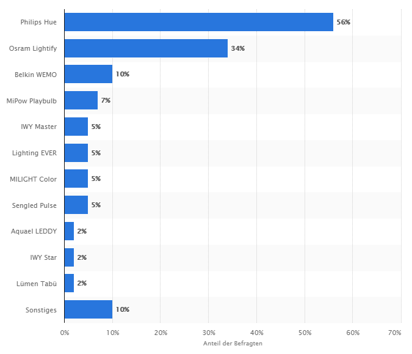
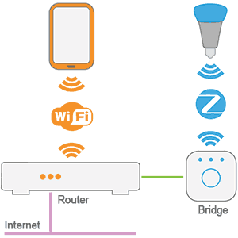

# Grundlegenes technisches Konzept

Ziel der Recheche ist herauszufinden, welche technische Funktionen und Eigenschaften ein neues Smart-Light-Produkt haben muss, um am Markt erfolgreich teilnehmen zu können. Dazu werden Trends und Technologien im relevanten Bereich erfasst und bewertet, und anschließend Entscheidungen für das Projekt Sonnenglas Sirius begründet.

## Smart Lighting
Smart Lighting bezeichnet Beleuchtungssysteme, die über eine oder mehrere Funktechnologien verfügen und sich über externe Anwendungen oder Geräte steuern lassen. Besonders in Verbindung mit Smart-Home und Internet-of-Things werden Smart-Lights eingesetzt und erfreuen sich zunehmend großer Beliebtheit. Prognosen zufolge ist in Europa ein signifikater Marktwachstum zu erwarten; größte Faktoren hierfür ist der Wohlstand in der Region und die starke Verbreitung von Smart-Home [1].

## Marktsituation
Laut Studie von Statista ergibt sich eine folgende Marktaufteilung zum Zeitpunkt Ende 2016 [2]:

### Philips Hue
Philips Hue ist die dominante und meiste verbreitete Smart-Light-Plattform. Sie existiert seit 2012 und bekam 2016 ein großes Update. Die größte Stärke ist die Reife der Plattform, die Offenheit der Schnittstellen sowohl für Apps, als auch für Hardware, und die damit verhandene Konnektivität zu allen bedeutenden Plattformen wie Amazon Alexa, Google Assistant, Apple Homekit, IFTTT oder OpenHAB.

Philips legt besonders Wert darauf, alle Schnittstellen offen zu halten, um Produkte für das Hue-Ökosystem zu gewinnen. Zu den sogenannten "friends of hue" gehören beispielweise Produkte von Bosch und Razer.

Das Herzstück von Philips Hue ist die Hue Bridge, die als zentrale Steuerzentrale funktioniert. Die Bridge bietet Wi-Fi und Ethernet als Verbindung ins Heimnetzwerk zu Smart-Home-Systeme sowie zur Cloud, und ZigBee Light Link als Schnittstelle zu Lichthardware. 

Diese Struktur ist übrigens bei allen großen Plattformen vorzufinden und bietet eine Reihe an technische Vorteile, die in der technischen Dokumentation genauer erläutert werden.

### Osram Lightify

Osram bietet mit Lightify ein Alternativsystem zu Philips Hue an. Das Konzept und die Technik ist im Ganzen vergleichbar. Allerdings unterstützen smarte Osram-Produkte sowohl Lightify, als auch Philips Hue. Osrams Marktanteil ist, besonders außerhalb von heimischen Markt, deutlich geringer als Philips und Kunden, die bereits auf Philips Hue gesetzt haben, sparen sich durch die Kompatibilität zusätzliche Hardware und Aufwand für dessen Einrichtung. 

### Andere nennenswerte Konkurrenz
Besonders im letzten Jahr kämpften viele Herstelle auf dem Markt der smarten Lichtprodukte.

Ein großer Name ist Ikea, der mit [Tradfri](https://www.ikea.com/de/de/catalog/categories/departments/lighting/smart_lighting/) ein eigenes Smart-Lighting-System durchsetzen möchte. Belkin hat mit [Wemo](https://www.belkin.com/de/PRODUKTE/home-automation/c/wemo-home-automation/) ebenfalls ein ähnliches System im Angebot.

Diese beiden genannten Systeme basieren ebenfalls auf eine Bridge-Struktur.

Es gibt auch "bridgelose" Smart-Light Lösungen. Diese besitzen eine integrierte Wi-Fi Schnittstelle für die Steuerung per App und die Anbindung an Smart-Home-Systeme. Die populärste Lösung ist [LIFX](https://www.lifx.com/). Auch Xiaomi kommt mit [Yeelight](https://www.yeelight.com/en_US/product/wifi-led-c) ohne Bridge aus. Kleinere Hersteller wie [Roome](http://en.myroome.com/) setzen ebenfalls auf eine eigene Lösung. 

## Benchmark und Bewertung
Technisch gesehen ist die Architektur mit einer Bridge die sauberste und sinnvollste Lösung. Besonders in Hinblick auf Mobilität und UX ist es wenig sinnvoll, das Sonnenglas Sirius mit Wi-Fi auszustatten. 

Um eine Bewertung der Marktteilnehmer zu ermöglichen, wurden folgende Produkte bestellt, auf Funktionalität und Zuverlässigkeit untersucht und anschließend einen Teardown unterzogen, um auch einen Einblick auf die Hardwarekomponenten zu bekommen:

- Philips Hue Go inkl. Bridge 
- Osram Lightify RGBW Strip
- Xiaomi Yeelight Candela
- Xiaomi Yeelight RGB Strip
- Roome Smart Light
- Roome Mini Plus
- (Netatmo Raumsensor)

Zusätzlich wurden Erfahrungsberichte und Rezensionen in Betracht gezogen, besonders zu Systemen wie LIFX und Tradfri, die nicht bestellt wurden. 

Im Allgemein lässt sich feststellen, dass Hue die einzige Plattform ist, die eine angenehme Usererfahrung erlaubt und desse Produkte wirklich hochwertig erscheint, obwohl diese technisch gesehen eher einfach gestaltet sind. Besonders Konkurrenzprodukte wie LIFX oder Roome, die sich mit besonders viel Features oder günstigeren Preis durchsetzen wollen, sind von unreifen Lösungen geplagt. 

So stellt sich der Einrichtungsrozess des Wi-Fis für sehr viele Käufer als Herausforderung heraus, wobei im Fall von Roome die Lampe tatsächlich nicht einrichten ließ. Diese negative Erfahrung spiegelt sich beispielsweise in Amazon-Rezensionen wieder, wo viele LIFX Produkte nur 2,x/5 Sterne bekommen.

Produkte, die sich über Bluetooth steuern lassen, lassen sich hingegen sehr einfach einrichten. Ein positives Beispiel ist das Xiaomi Yeelight, dessen Pairingprozess sogar eine kleine Begeistrung ausgelöst hat, indem man die Paring durch das Drehen des Gehäuses bestätigt wurde. Allgemein ist die Steuerung über Bluetooth deutlich zuverlässiger, weil im Gegensatz dazu die Befehle im Wi-Fi abhängig vom Netzwerklast verzögert ankommen können.

Eine Inspiration durch Roome Mini Plus ist eine Sockellösung, die als Docking Station oder kabellose Ladestation funktionieren kann. Es ist davon auszugehen, dass die zur Verfügung stehende Solarladefläche nicht für eine intensive Nutzung des Sonnenglas Sirius ausreichen wird. Deswegen wäre eine externe Ladestation eine elegante Lösung für eine ergänzende Lademöglichkeit.

## Ergebnis
Um die gewünschte Spezifikationen des Sonnenglas Sirius bestmöglich zu erfüllen, wird die folgende Lösung vorgeschlagen:

- Grundlegende Steuerung per App werden mit Bluetooth realisiert. Das beinhaltet Ein- und Ausschalten, sowie das Aktivieren von verschiedenen Modi sowie das Auslesen von eingebauter Sensorik
- Die Smart-Home- und Cloud-Anbindung wird mit Philips Hue-Kompatibilität realisiert
- Duale Lademöglichkeit: Solar und Docking Station / Wireless Charging
- Rotierendes Bedienungselement

Genauere Entwurfvorschläge werden in den anderen Konzeptdokumenten ausführlicher diskutiert.

## Quellen
1: [Marketwatch](https://www.marketwatch.com/press-release/smart-lighting-market-2018-global-overview-comprehensive-research-study-historical-analysis-opportunities-competitive-landscape-and-industry-expansion-strategies-2023-2018-06-01)

2: [Statista](https://de.statista.com/themen/3761/smart-lighting/)
