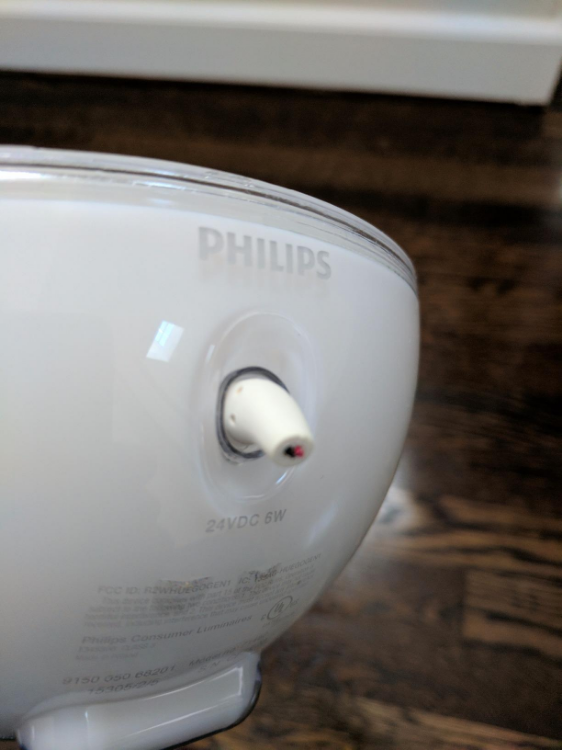
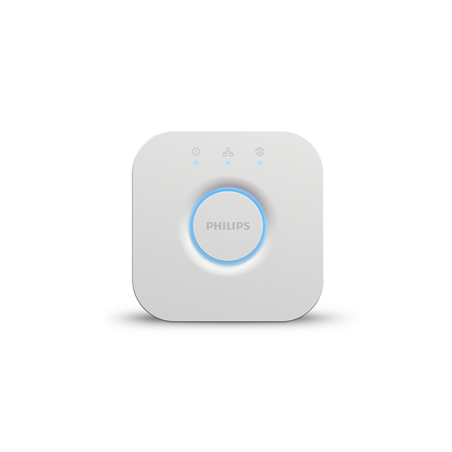
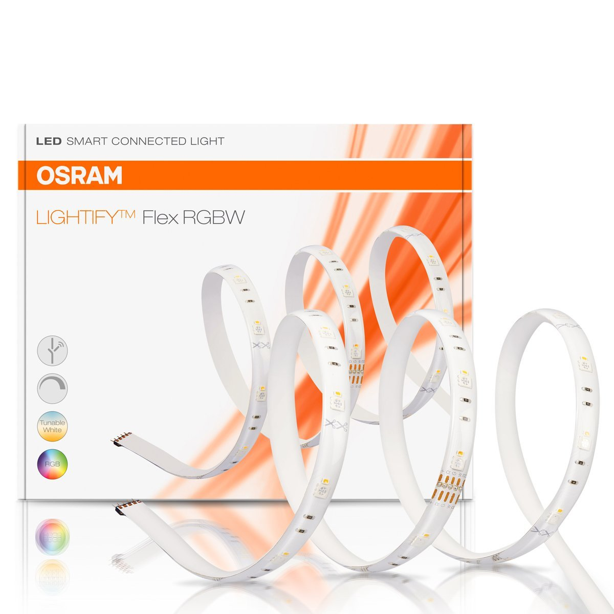

# Customer Reviews

### Philips Hue Go

##### Pros

1. Candlelight Effect

  - The Philips Hue Go supports the Candlelight effect feature as part of the HueLabs section in the Hue app and many users have reported that this is an awesome feature and are reeally happy with the effect.
  - The candle setting is the family favorite for most situations. The gentle flickering of soft yellow light is a great imitation of candle-light and a relaxing, much-used effect.

2. Design, Light and Colour Range

  - Produces a decent amount of light and the color range is amazing.
  - Minimalist clean design

3. Seamless Functioning

  - The [Hue Smart Bridge](https://www.amazon.com/Philips-Hue-Smart-Bridge-Compatible-with-Amazon-Alexa-Apple-HomeKit-and-Google-Assistant/dp/B014H2P42K/ref=cm_cr_dp_d_rvw_txt?ie=UTF8) and the [Hue Dimmer](https://www.amazon.com/Philips-Hue-Smart-Dimmer-Switch-with-Remote-Installation-Free-Exclusive-for-Philips-Hue-Lights/dp/B0167Z0P3I/ref=cm_cr_dp_d_rvw_txt?ie=UTF8) which in combo permit control by both the Hue Dimmer control or by using voice commands through Amazon's Echo works perfectly with the Hue Go.

##### Cons
- The product is not shock resistant and may or may not crack if it falls down since the build is from plastic and it can break.
- The Philips Hue Go is said to last "up to 3 hours" on battery. That could only be possible if the light was set to the dimmest setting, which practically the majority won't do. Consequently, it has to be plugged in most of the time. And when its plugged in it doesn't sit up all that well, as the wire obstructs its default position and hence the light has to be kept such that the light is pointing straight up.
- Due to its plastic build, the face scratches very easily. While the light still works, and the scratches don't affect the light, it doesn't feel that good to see the scratches when the light is off.
- If not connected to the Hue Bridge, then the user is limited to the factory preset lighting settings.
- While gently unplugging the power cord, the end of the cord easily broke off, leaving one half stuck in the plastic body of the light and the other half as live electrical wires coming from the DC power supply.

##### Wish List
- One desire would be for the light to be brighter, however, the light level is comfortable for your eyes when in direct line of sight.

### Philips Hue Bridge

##### Pros
- Very simple to set up and sync with the app. Takes just less than 10 minutes.

- The new hub is much more powerful compared to the previous generation and for customers having a lot of Hue Devices, the issues of lag and inconsistency (which they faced on the previous generation Hub) were fixed.

- Works well with Echo Dot to handle a multitude of Smarthome devices.

##### Cons
- Some people have brought this up as a negative even though it is not that complicated. The Hue bridge need to be connected to internet via ethernet (LAN Cable).

- While it is advertised that all of the bulbs are compatible with the Amazon Echo Plus (which is a hub of its own) and that is TECHNICALLY true, you will not be able to control the bulbs fully (changing colors quickly and easily, using Hue Disco, Hue Mood, etc) unless you buy the Philips Hue Smart Hub IN ADDITION to the Echo Plus that you already paid a lot of money for.

- For those looking at the bridge, if you only need to turn on and off the lights, just stick with the echo, it works great. If you need schedules or time settings for the lights, you'll need this but be ready for a little extra time and effort to get it going.

##### Wish List
- The Hub does not back up your programmed routines and rooms and lights to your device you've used to set up the Hue system. It is all saved within this Hub - so if you fry it, you have to teach a new one everything all over again by hand.

### Osram Lightify RGBW Strip

##### Pros
- If the strip is used as a reading light or work light, OSRAM is better off, as they are a lot brighter and OSRAM has installed a warm white LED in addition to the RGB LEDs which diligently brightens up the room.

- Very good for indirect lighting.

- in areas where a lamp assembly would be costly, you can set fantastic lighting effects with the band. The different colors are fantastic and it is fun to dive the apartment in different colors. Also suitable in glass showcases and other pieces of furniture such as in a wardrobe or a glass cabinet as lighting.

##### Cons
- you should not use both Hue Light strips and the Osram Lightify together, because Osram Lightify usually reacts a bit slower (so Ambilight is a bit asynchronous) and for the Hue strip, the colors are a bit fuller and clearer - but if you do not have a direct comparison, you can use it without hesitation.

- The connecting cable is unfortunately a bit short.

##### Wish List
