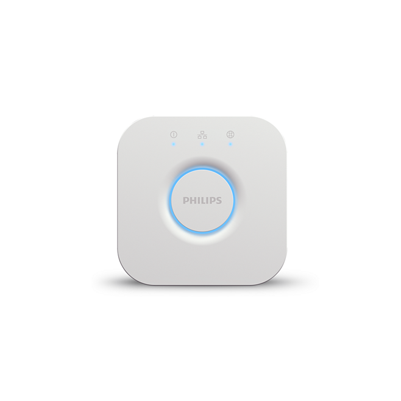
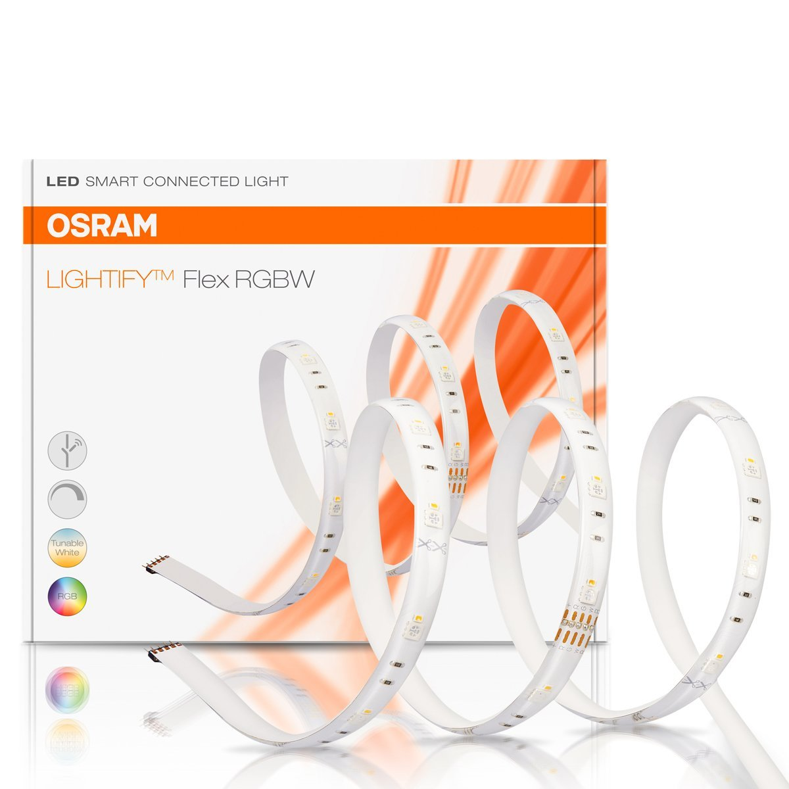
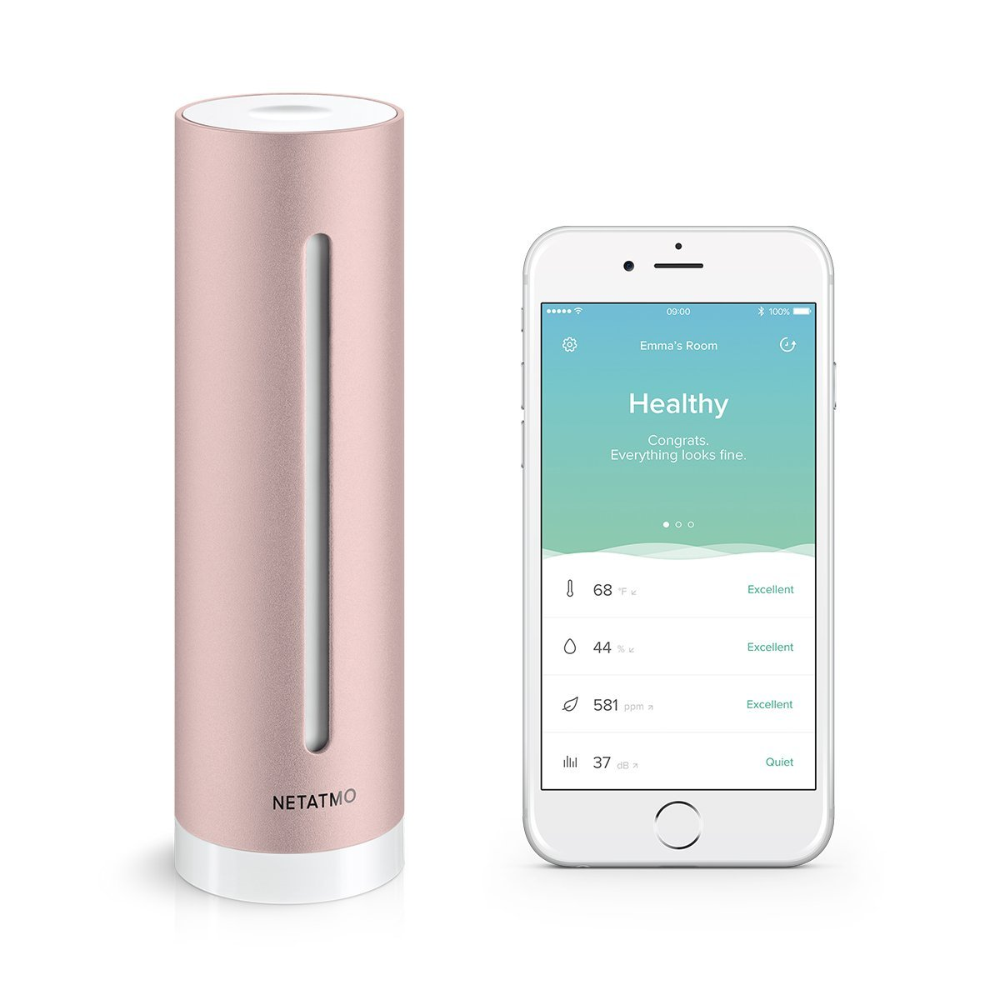

# Customer Reviews

### Philips Hue Go
[](images/Philips_Hue_Go/0.png)

##### Pros
1. Candlelight Effect
    - The Philips Hue Go supports the Candlelight effect feature as part of the HueLabs section in the Hue app and many users have reported that this is an awesome feature and are reeally happy with the effect.
    - The candle setting is the family favorite for most situations. The gentle flickering of soft yellow light is a great imitation of candle-light and a relaxing, much-used effect.
2. Design, Light and Colour Range
    - Produces a decent amount of light and the color range is amazing.
    - Minimalist clean design
    - Lights up in 16 million colors
    - Alarm and timer features
3. Seamless Functioning
    - The [Hue Smart Bridge](https://www.amazon.com/Philips-Hue-Smart-Bridge-Compatible-with-Amazon-Alexa-Apple-HomeKit-and-Google-Assistant/dp/B014H2P42K/ref=cm_cr_dp_d_rvw_txt?ie=UTF8) and the [Hue Dimmer](https://www.amazon.com/Philips-Hue-Smart-Dimmer-Switch-with-Remote-Installation-Free-Exclusive-for-Philips-Hue-Lights/dp/B0167Z0P3I/ref=cm_cr_dp_d_rvw_txt?ie=UTF8) which in combo permit control by both the Hue Dimmer control or by using voice commands through Amazon's Echo works perfectly with the Hue Go.
    - Works with IFTTT and many third-party Hue apps
    - Ambify (third party app) lets you sync the Hue lights with iTunes music which was a feature upvoted by many customers

##### Cons
- The product is not shock resistant and may or may not crack if it falls down since the build is from plastic and it can break.
- The Philips Hue Go is said to last "up to 3 hours" on battery. That could only be possible if the light was set to the dimmest setting, which practically the majority won't do. Consequently, it has to be plugged in most of the time. And when its plugged in it doesn't sit up all that well, as the wire obstructs its default position and hence the light has to be kept such that the light is pointing straight up.
- Due to its plastic build, the face scratches very easily. While the light still works, and the scratches don't affect the light, it doesn't feel that good to see the scratches when the light is off.
- To tap into the full potential of the Philips Hue Go, you’ll need a Bridge connected to your local network. If not connected to the Hue Bridge, then the user is limited to the factory preset lighting settings. Buying the $60 bridge adds a moderate amount of money to the overall cost of your investment.
- While gently unplugging the power cord, the end of the cord easily broke off, leaving one half stuck in the plastic body of the light and the other half as live electrical wires coming from the DC power supply.

- Basic and Mediocre app - The alarm and timer feature doesn't work properly (as reported by many users)
- Non-replaceable battery and bulb

##### Wish List
- One desire would be for the light to be brighter, however, the light level is comfortable for your eyes when in direct line of sight.

### Philips Hue Bridge



##### Pros
- Very simple to set up and sync with the app. Takes just less than 10 minutes.

- The new hub is much more powerful compared to the previous generation and for customers having a lot of Hue Devices, the issues of lag and inconsistency (which they faced on the previous generation Hub) were fixed.

- Works well with Echo Dot to handle a multitude of Smarthome devices.

##### Cons
- Some people have brought this up as a negative even though it is not that complicated. The Hue bridge need to be connected to internet via ethernet (LAN Cable).

- While it is advertised that all of the bulbs are compatible with the Amazon Echo Plus (which is a hub of its own) and that is TECHNICALLY true, you will not be able to control the bulbs fully (changing colors quickly and easily, using Hue Disco, Hue Mood, etc) unless you buy the Philips Hue Smart Hub IN ADDITION to the Echo Plus that you already paid a lot of money for.

- For those looking at the bridge, if you only need to turn on and off the lights, just stick with the echo, it works great. If you need schedules or time settings for the lights, you'll need this but be ready for a little  extra time and effort to get it going.

##### Wish List
- The Hub does not back up your programmed routines and rooms and lights to your device you've used to set up the Hue system. It is all saved within this Hub - so if you fry it, you have to teach a new one everything all over again by hand.

### Osram Lightify RGBW Strip


##### Pros
- If the strip is used as a reading light or work light, OSRAM is better off, as they are a lot brighter and OSRAM has installed a warm white LED in addition to the RGB LEDs which diligently brightens up the room.

- Very good for indirect lighting.

- in areas where a lamp assembly would be costly, you can set fantastic lighting effects with the band. The different colors are fantastic and it is fun to dive the apartment in different colors. Also suitable in glass showcases and other pieces of furniture such as in a wardrobe or a glass cabinet as lighting.

##### Cons
- you should not use both Hue Light strips and the Osram Lightify together, because Osram Lightify usually reacts a bit slower (so Ambilight is a bit asynchronous) and for the Hue strip, the colors are a bit fuller and clearer - but if you do not have a direct comparison, you can use it without hesitation.

- The connecting cable is unfortunately a bit short.

### Roomelight Air Touch


##### Pros
- The built-in speaker could be used as a wake-up alarm. However, the quality of the speaker is not that great.
- The USB charging ports were found to be useful for some of the customers.

##### Cons
- While it can be used as a bedside lamp, some customers reported that the light came ON several times in the night (because of the motion sensor it has) and it was disturbing their sleep. If it were to be used as a bedside lamp, it was better to turn off the lamp completely at night.

  UPDATE:

  ```When you're sleeping, moving around on the bed won't trigger Roome. It only turns on as you're getting up from the bed. Because everyone’s sleep habits are different, Roome needs a few nights to learn from you. If it turns on/off when not desired please turn it on/off manually which will help its learning process. During the night Roome will use the dim light mode (usually between midnight and 7am). if you want a brighter light simply turn Roome on/off to reset the brightness mode.``` - Taken from Kickstarter.com. A normal customer might be unaware of the specifics of the AI feature that Roome claims it has and that it will learn the user habits after a couple of nights. A normal user might give up on the product if they are not informed properly about the features.
- The Roome App is a total disaster. You need to register with your mail/phone number before you can pair your device with the lamp. Customers also reported to have faced issues while trying to set up the lamp. The lamp was not being detected with the device and at times it the app was not pairing with the device.
- The brightness adjustment using gesture control was erratic.

### Roomelight Mini Plus


##### Pros
- The lamp is lightweight enough to carry easily.
- The Power On/off and the brightness control - everything is controlled by a single switch on the lamp. The design was appreciated by people who love minimalist designs (even though there is no labelling on the lamp about the controls, the design is minimalist and some found it attractive)

##### Cons
- The controls are not clearly labelled and the customers can get confused between the standby mode and power off mode. However the user guide which came along with the lamp explained the instructions clearly.
- The device is supposedly having a pseudo-wireless charging feature. The charging base has two contacts which should accurately come in contact with the chargin terminals on the lamp and the lamp will charge only if this happens. So it's kind of a gimmick and not really wireless charging.
- Out of the few reviews on amazon, one customer soon returned the lamp stating that it was not user friendly - this might be because of the trouble in setting up the lamp. The Roome app is not good (the QR code on their user guide returns an error 404 and one should manually search and install the app) and the device pairing with the lamp is also not hassle free.

### Yeelight Candela


##### Pros
- Bluetooth mesh feature lets you control a group of Yeelight Candelas together. Group control was appreciated by many customers.
- The Candlelight flicker mode (even though not the best in the market) was found to be attractive for many users to set romantic mood or for a mood to narrate bedtime stories to children.

##### Cons
- It has only bluetooth and no WiFi and hence it can't possibly work with IFTTT, Smart Thing etc even in the future.
- Limited battery backup - 7 hours as mentioned by the customer (Yeelight promises 8 hours of continuous use on a single charge).

##### Wish List
- Higher battery capacity
- WiFi Capability and hence integration with Alexa, Siri or Google Home.

### Yeelight Smart Strip


##### Pros
- Voice Control: work with Amazon Alexa, Google Assistant for voice control, and IFTTT
- Group Control: Set groups to control multi strips or other YEELIGHT products all together
- No Bridge required: Yeelight has wifi built in and the device is standalone. It doesn't require a hub (like in the case of Philips - Hue Bridge) to have its full functionality.
- Inexpensive ($39,99) compared to Philips Hue Lightstrip ($59,99) and needs no additional devices like a Hub which really gives the product an edge in the market.


##### Cons
- Does not work with Apple HomeKit
- Some users have reported that the **WiFi connections falls repeatedly**. The connection can't be restored unless the Light strip is power cycled.
- People who were satisfied with the product initially have changed their reviews later on stating that the WiFi falling issue is serious making the product almost unusable.

##### Wish List
- Wireless dimmer switch or controller Remote
- HomeKit Integration

### Netatmo Healthy Home Coach


##### Pros
- Works with Apple HomeKit and Siri.
- The app is great and the customers are highly satisfied with it.
- For a normal customer who is unaware of the working of the product or the components inside the product, the customer considers the product value for money and is very happy with the performance of the product. Around 50% of the customer reviews on Amazon are 5 stars. But for a little bit tech savvy customers, they believe that the product is overpriced.

##### Cons
- Does not work with Alexa, IFTTT, Google Home etc.
- Measures only CO2 to indicate air quality and the response from their official customer support on Amazon is:

  ```It measures CO2 levels but does not measure particles or gases. The CO2 levels and the alerts let you know when you need to open your window to lower your indoor air pollution. Other sensors are not used as they can be misleading. For instance, some sensors measure "total VOCs", which basically is like adding peaches and apples as many VOCs are not harmful at all for human.```

- Customers have named the product as a WiFi thermometer and a CO2 Monitor which is true to be honest. The product is overpriced for what it does.
- Customers had trouble pairing the product with their apple devices.

## Things to keep in mind for Sirius
1. Ensure that the WiFi connection is stable under continuous use and it never drops.
2. A wireless remote which can work as a dimmer/power ON-OFF switch would be good. This can be offered as an add-on product for the customers who feel they need it. (Philips Hue system offers a smart [smart dimmer switch](https://goo.gl/VAJ1WU) as an add on product for $24,99).
