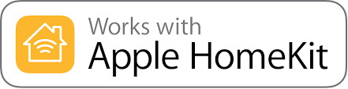
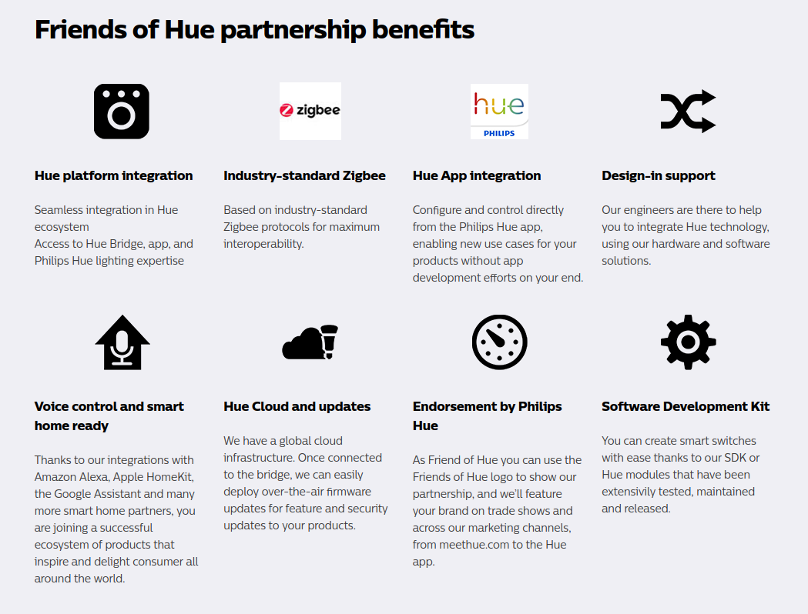
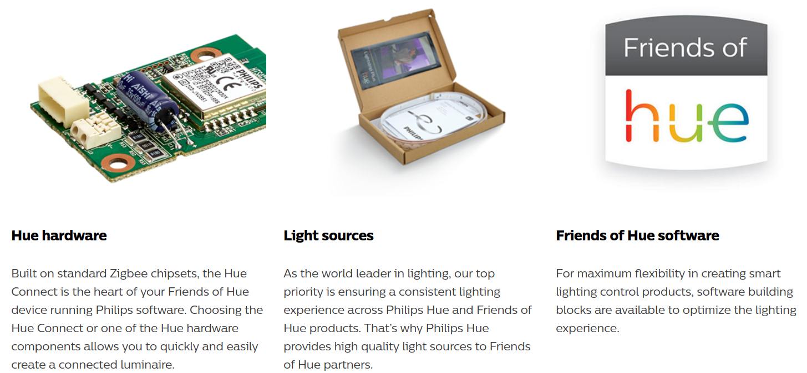

# Apple Homekit


### What is HomeKit?
HomeKit is Apple's smart-home software. It works in the background on modern Apple devices and allows you to control your connected lightbulbs, locks and thermostats without jumping to a different app for each one.

#### Developing for HomeKit - https://developer.apple.com/homekit/
Whether you’re a smart home enthusiast, app developer, or manufacturer, you could create apps or products which can work with the Apple Homekit.

If you’re interested in developing or manufacturing a HomeKit accessory that will be distributed or sold, your company must enroll in the **MFi Program**. If you join the MFi Program you get the following benefits:


- HomeKit Accessory Protocol Specification (commercial version).
- Third-party SDKs for commercial development.
- “Works with Apple HomeKit” Certification and tools.


- Logo artwork and identity guidelines.

#### Using the HomeKit Accessory Protocol Specification (Non-Commercial Version)
https://developer.apple.com/support/homekit-accessory-protocol/

HomeKit Accessory Protocol (HAP) is Apple’s proprietary protocol that enables third-party accessories in the home (e.g., lights, thermostats and door locks) and Apple products to communicate with each other. HAP supports two transports, IP and Bluetooth LE.

##### 1. How will a commercial HomeKit accessory be different from an accessory that I create using this specification?

Unlike a non-commercial HomeKit accessory, a HomeKit accessory that will be distributed or sold must incorporate the Apple Authentication Coprocessor, obtain Wi-Fi Alliance certification or Bluetooth SIG certification depending on the transport used, and complete HomeKit certification under the MFi Program. _(Information exactly as mentioned in Apple's official website)_

However, at Apple's Worldwide Developers Conference (WWDC), Apple freed up its Smart Home Platform To Kickstart Development. Apple said that HomeKit is now open to any Apple developer to tinker around with. **But once these developers want to bring a product out commercially, they still have to go through MFi certification.** Nevertheless, this should make it easier for developers to start building HomeKit products. (Source - Forbes - https://goo.gl/vPQH9m)

More importantly, Apple also updated the HomeKit specification so that developers no longer have to go through the trouble of integrating an authentication chip into their products. Instead, all the authorization can go through software now. Any existing product or future product can do this software authorization. The devices just need a firmware update. Apple said it would still have all the same heavy-duty encryption running on it. (Source - Forbes - https://goo.gl/vPQH9m)

The only official news which we have from Apple regarding this is from the changelog of iOS 11.3 (Source - https://support.apple.com/en-us/HT208067#113) where it is mentioned:

```"Adds support for software authentication as a new way for developers to create and enable HomeKit compatible accessories" ```
under "Other improvements and fixes". So this feature has already been rolled out in the market.

##### 2. How do I develop or manufacture a HomeKit-enabled accessory for distribution or sale?
Your company must first enroll in the MFi Program. HomeKit accessories that are distributed or sold to third parties must comply with MFi program requirements, including completion of HomeKit certification, before being manufactured, distributed or sold.
##### 3. Can I use the “Works with Apple HomeKit” logo in connection with my accessory?
No, the logo may only be used in connection with commercial accessories that have completed HomeKit certification under the MFi Program.

### Synopsis on HomeKit
1. If we want to get the "Works with Apple HomeKit" Certification, we need to join the MFi Program and clear the tests.
2. If we want to have the MFi Certification, we need to pay a fee to complete the company identity verification.
3.


# Friends of Hue - Philips

The Friends of Hue program is your partner in developing products that integrate seamlessly with Philips Hue. We are offering smart building blocks and integration in the Philips Hue app, allowing your products to benefit from all the features of the Hue ecosystem.

### Benefits (https://www2.meethue.com/en-us/integrate)

More than a hardware program, Friends of Hue is a partnership. By partnering with Philips Hue you join a growing ecosystem of Hue and Friends of Hue products that are together redefining lighting.

Your products can:

- Carry the Friends of Hue logo
- Receive brand exposure through Philips Hue marketing channels and events
- Be featured on Meethue.com and in the Philips Hue app
- Work with a rich ecosystem of over 700 third party apps
- Integrate with popular voice platforms such as Google Home, Amazon Alexa and Apple HomeKit

Friends of Hue partners also have access to many of the same hardware and software components used in Philips Hue products.




