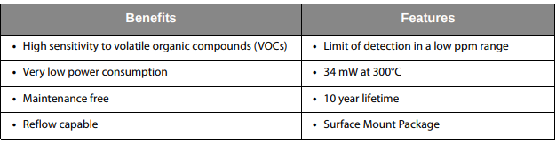
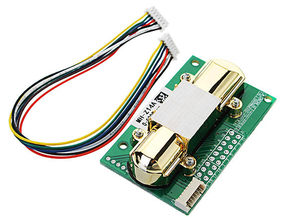
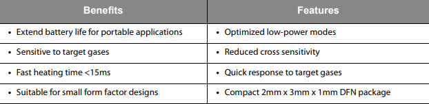
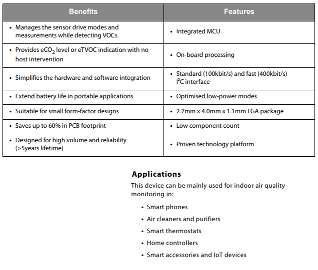
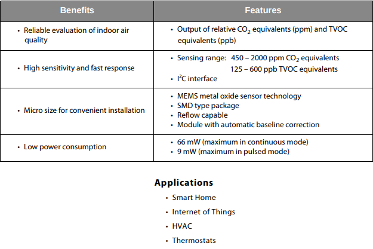

# Overview of Air Quality Sensors

**Things to note**

- Most of the *low cost sensors* are capable of ***detection*** and it only gives an output signal if the CO2 or some other gas concentration exceeds a referance value. It is not capable of giving analog value corresponding to the concentration of the gases.
- Some of the CO2 Sensors are sensitive to solar radiation. Some works erratically if subjected to solar radiation and for some, the lifetime is affected if subjected to solar radiation. Since our use case involves constant exposure to the sun, select a sensor which is immune to solar radiation.

1.
## AS-MLV-P2 (ams) - 18,30 €
Datasheet - [https://goo.gl/zMEQ2B](https://goo.gl/zMEQ2B)

The ams **AS-MLV-P2** is a MOS (metal oxide semiconductor)
based gas sensor component.

***Detectable gases: ***
- VOCs (volatile
organic compounds) and
- CO (carbon monoxide)

associated with bad air quality. The AS-MLV-P2 sensor component is a MEMS (micro electromechanical system) device using silicon wafer technology.

2.

## MG811 sensor (sandboxelectronics)
- sensor only - 16,79 $ (aliexpress)
- sensor module - 24,99 $

Datasheet - https://goo.gl/WgCFp8

The MG-811 is highly sensitive to CO2 and less sensitive to alcohol and CO. It could be used in air quality control, ferment process, in-door air monitoring application. The output voltage of the module falls as the concentration of the CO2 increases.

***Detectable gases: ***
- Carbon Dioxide (CO2)

3.
## MH-Z14A(Winsen) - 19,99 €
Datasheet - https://goo.gl/RDca3A

*The* ***Netatmo*** *product also uses a NDIR CO2 Sensor (it looks similiar to this sensor).*

MH-Z14A NDIR Infrared gas module is a common type, small size sensor, using non-dispersive
infrared (NDIR) principle to detect the existence of CO2 in the air, with good selectivity, non-oxygen dependent and long life. Built-in temperature compensation; and it has digital output, analog voltage output, and PWM output.

***Detectable gases: ***
- Carbon Dioxide (CO2)

4.
## MiCS-6814 (SGX Sensortech) - 14,57 €
Datasheet - https://goo.gl/XdqHoZ

The MiCS-6814 is a robust MEMS sensor for the
detection of pollution from automobile exhausts and for
agricultural/industrial odors.

***Detectable gases: ***
- Carbon monoxide CO 1 – 1000ppm
- Nitrogen dioxide NO2 0.05 – 10ppm
- Ethanol C2H5OH 10 – 500ppm
- Hydrogen H2 1 – 1000ppm
- Ammonia NH3 1 – 500ppm
- Methane CH4 >1000ppm
- Propane C3H8 >1000ppm
- Iso-butane C4H10 >1000ppm

5.
## MiCS-5524 (SGX Sensortech) - 12,46 €
Datasheet - https://goo.gl/Qs61Ju
The MiCS-5524 is a robust MEMS sensor for indoor
carbon monoxide and natural gas leakage detection;
suitable also for indoor air quality monitoring; breath
checker and early fire detection.

***Detectable gases: ***
- Carbon monoxide CO 1 – 1000ppm
- Ethanol C2H5OH 10 – 500ppm
- Hydrogen H2 1 – 1000ppm
- Ammonia NH3 1 – 500ppm
- Methane CH4 >1000ppm

6.
## CCS801 (ams) - $4.44
Datasheet - https://goo.gl/vPQQZU

CCS801 is an ultra-low power analog sensor for monitoring
indoor air quality including Carbon Monoxide (CO) and a wide
range of Volatile Organic Compounds (VOCs) such as Ethanol.
CCS801 can be used as an equivalent carbon dioxide (eCO2)
sensor to represent eCO2 levels in real world environments,
where the main source of VOCs is from humans.

***Detectable gases: ***
- Carbon Monoxide (CO)
- Volatile Organic Compounds (VOCs) such as Ethanol

7.

## CCS811 (ams) - $7.25
Datasheet - https://goo.gl/3wd45q

The CCS811 is an ultra-low power digital gas sensor solution
which integrates a metal oxide (MOX) gas sensor to detect a
wide range of Volatile Organic Compounds (VOCs) for indoor
air quality monitoring with a microcontroller unit (MCU), which
includes an Analog-to-Digital converter (ADC), and an I²C
interface.

***Detectable gases: ***
- Volatile Organic Compounds (VOCs)
- equivalent total VOC (eTVOC)
- equivalent CO2 (eCO2) values

8.
## iAQ-Core (ams) - $26.07
Datasheet - https://goo.gl/UF4b6u

The iAQ-Core sensor module is used to measure VOC levels and
provide CO2 equivalent and TVOC equivalent predictions. The
data is available via I²C bus.

***Detectable gases: ***
- Volatile Organic Compounds (VOCs)
- equivalent total VOC (eTVOC)
- equivalent CO2 (eCO2) values

