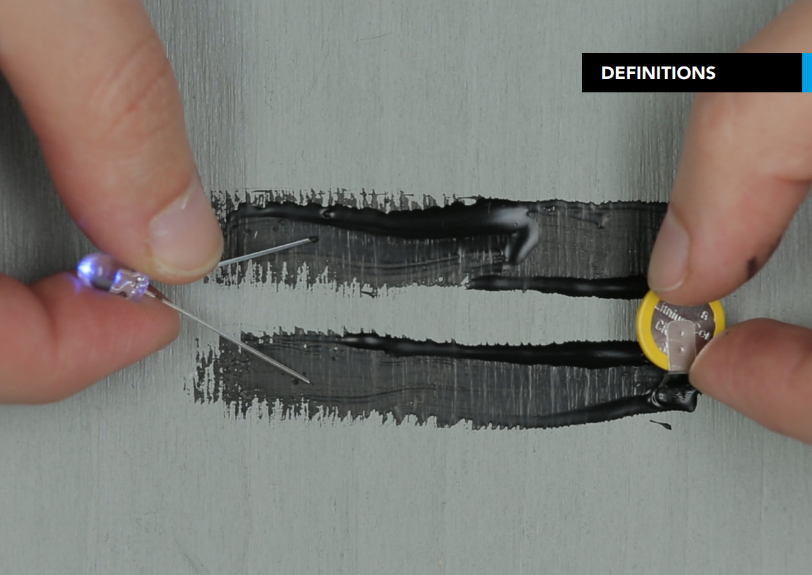
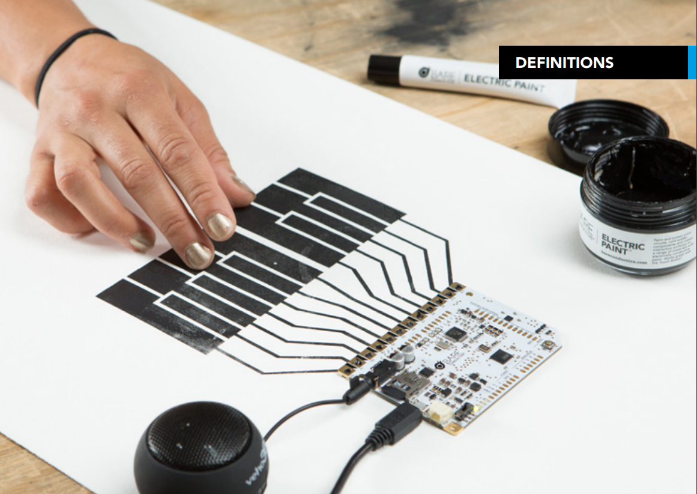
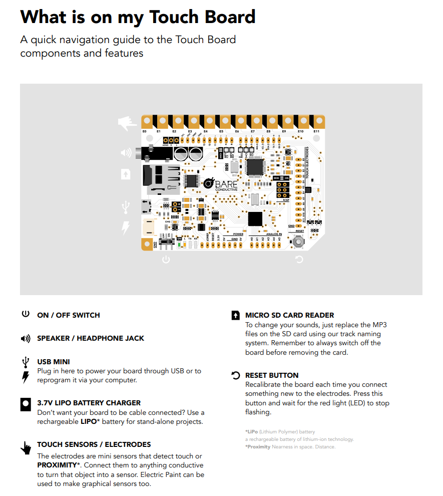
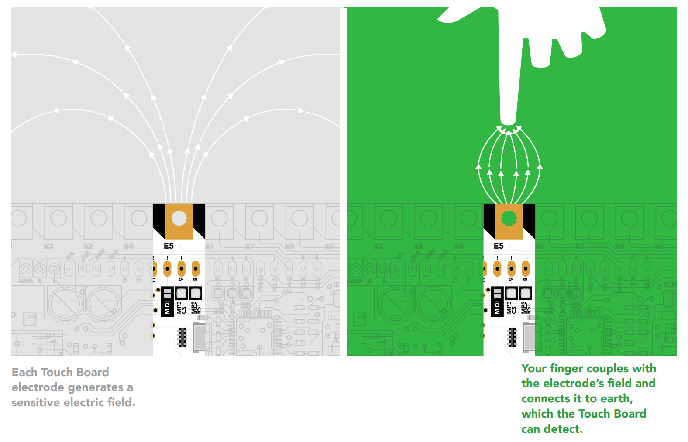

# Bare Conductive Tech

### Different Components for this Tech

1. ELECTRIC PAINT
It works like any other water-based paint, except it conducts electricity
It’s electrically conductive, non-toxic, solvent free and water
soluble. You can also stencil and screen print with it, just like a
normal paint. Although not as conductive as metal or copper
wire, it’s a great tool for **low-current** circuits and sensors.
Normally, it takes 15 mins to dry once painted.

2. TOUCH BOARD

A plug and play microcontroller board which lets you turn almost any material
or surface into a sensor.

Connect anything conductive to its 12 electrodes to
make your own sensors, then make music, control visuals or
create alarms — any output you want! It uses **capacitive sensing**, so you can trigger its electrodes
without direct contact. Calibrate it to sense touch or distance,
or program it just like an Arduino to create lots of projects
straight from the box.

This is how the Touch Board works with Capacitive Sensing:

Capacitive sensing is a proximity sensing technology.
It detects nearby objects by sensing that the electric
field generated by a sensor (in this case one of the 12
electrodes), has been disrupted. It can detect anything
that is conductive or that has a significantly different
permittivity* than that of air, like a human body or hand.
The Touch Board has **12** capacitive sensing electrodes, each
of which can individually detect touch and proximity.

#### Touch Board / Proximity Board
Although it’s called the Touch Board, what the electrodes are
really doing is sensing proximity via capacitive sensing. When
you set a sensors’ thresholds to be relatively high, the Touch
Board only responds to actual contact or touch, rejecting
proximity events.
If you want the Touch Board to sense something from further
away, or even through an insulation such as glass or plastic,
you can lower each sensors’ threshold to increase sensitivity
— turning the Touch Board into a ‘Proximity Board’.
