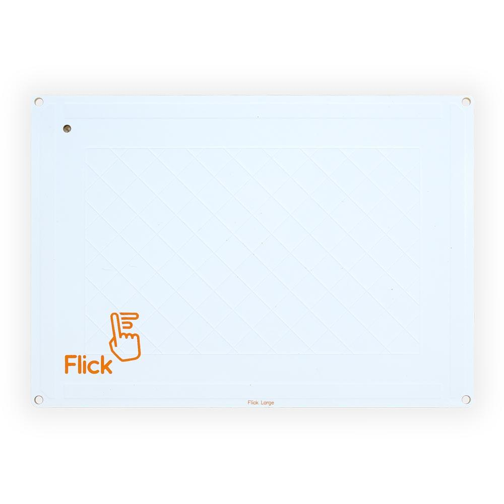

# Flick Tech
Flick Large is a 3D tracking and gesture board that lets you control the Raspberry Pi.
Flick Large is an extra large sized panel (148mm x 105mm) which connects via the i2c interface to the Raspberry Pi (or other devices)
Flick uses technology that enables the PCB to detect your gestures from up to 15cm away in 3D space.

Using **near field gesture technology**, you’re able to hide your project behind non conductive material (wood/acrylic) and still use Flick. However, mounting behind materials may reduce the sensor range.

Features
- Track positional data (x,y,z)
- Gesture sensing: Touch, Tap, Double Tap, Flick, Swipe etc
- Full software libraries (One line installer & fully opensource)
- No soldering required (Plug & Play!)
- Used Microchip - [MGC3130](http://ww1.microchip.com/downloads/en/DeviceDoc/40001667E.pdf) - 3D Tracking and Gesture Controller

