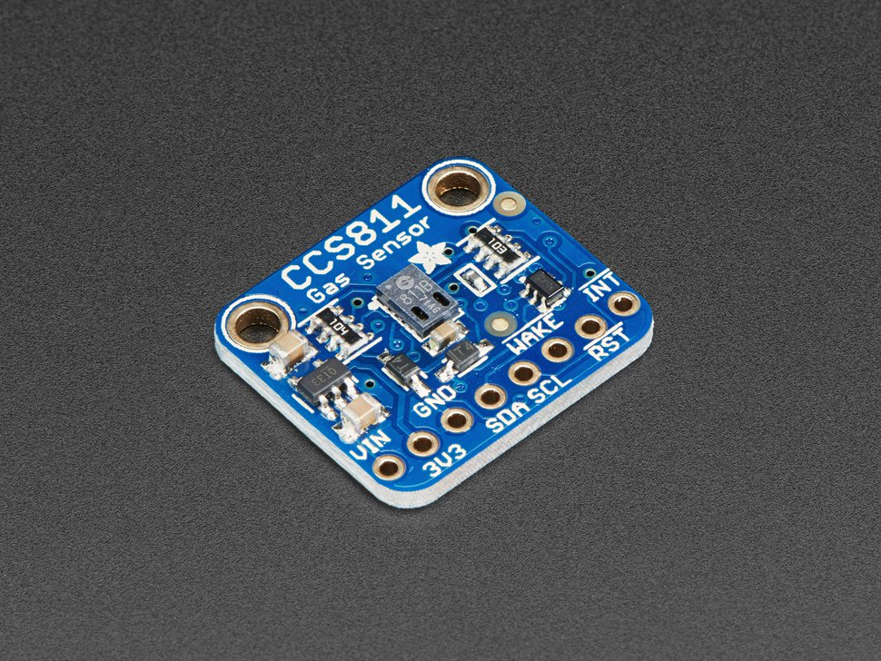
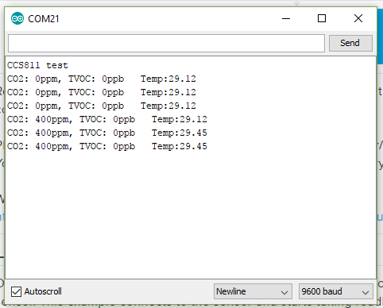
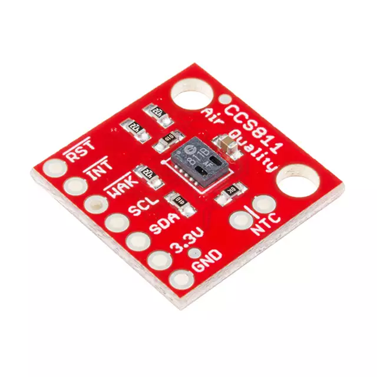
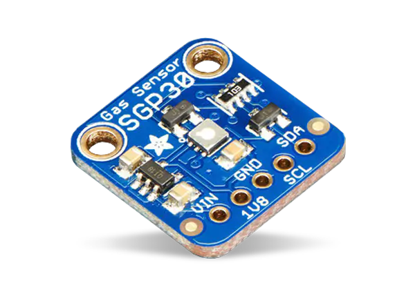
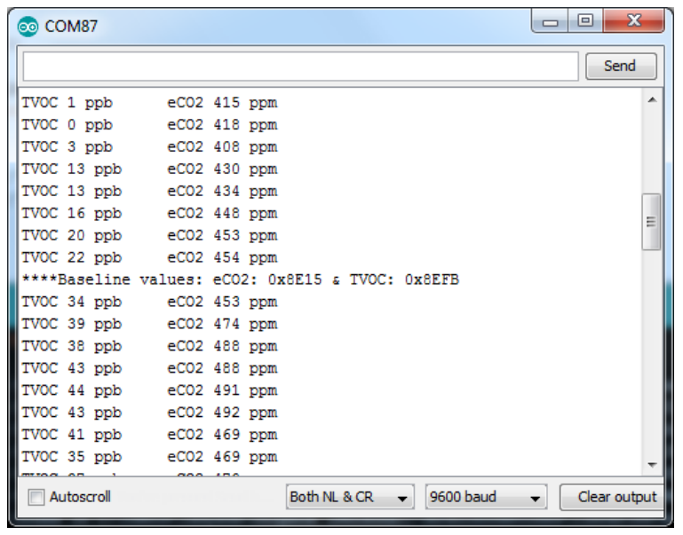

# Indoor Air Quality Sensors - Detailed Study

### 1. ADAFRUIT CCS811 AIR QUALITY SENSOR BREAKOUT - VOC AND ECO2 - Unit Price - $19.95
[Buy](https://www.adafruit.com/product/3709)

[Datasheet](https://goo.gl/83UZUW)

In our previous documentation which included the study about [air quality sensors](https://gitlab.motius.de/Sonnenglas/Sonnenglas_Sirius/wikis/Hardware/Air%20Quality%20Sensor), there was an IAQ sensor CCS811 ($7.25) from ams which measured :
- Volatile Organic Compounds (VOCs)
- equivalent total VOC (eTVOC)
- equivalent CO2 (eCO2) values

The CCS811 IAQ Sensor uses **3.3V** Vin.

The equivalent CO2 (eCO2) output range for CCS811 is from
400ppm up to 32768ppm. (adafruit - 400ppm to 8192ppm. Values outside this range are clipped)

The equivalent Total Volatile Organic Compound (eTVOC)
output range for CCS811 is from 0ppb up to 32768ppb. (adafruit - 0ppb to 1187ppb. Values outside this range are clipped)

## NOTE: The datasheet of CCS811 mentioned in Adafruit website and ams have significant differences in the measurement range.

According to the fact sheet it can detect Alcohols, Aldehydes, Ketones, Organic Acids, Amines, Aliphatic and Aromatic Hydrocarbons.

This Breakout board from Adafruit uses this [CCS811](https://goo.gl/83UZUW) sensor from ams and also includes a 10K NTC thermistor with matching balancing resistor which can be read by the CCS811 to calculate approximate temperature.
The Adafruit board has the sensor on a PCB with a 3.3V regulator and some level shifting so it can be easily used with a 3.3V or 5V microcontroller.

This chip uses **I2C clock stretching**, and some microcontrollers/computers don't support that (e.g. Raspberry Pi).

The CCS811 supports multiple drive modes to take a measurement every 1 second, every 10 seconds, every 60 seconds, or every 250 milliseconds.

Adafruit has a CCS811 Library - https://github.com/adafruit/Adafruit_CCS811/archive/master.zip

It also works with Python & CircuitPython.
The expected output on an Arduino is as follows:

### 2. SparkFun Air Quality Breakout - CCS811 - VOC and eCO2 - Unit Price - 16,89 €

[Buy](https://www.digikey.de/product-detail/en/sparkfun-electronics/SEN-14193/1568-1597-ND/7066452)

[Datasheet](https://media.digikey.com/pdf/Data%20Sheets/Sparkfun%20PDFs/SEN-14193_Web.pdf)

This breakout board is literally the same as the Adafruit one and it uses the same IAQ sensor - CCS811 ams sensor. All the features are identical as the previous one. More documentation is available from Sparkfun which includes a Hook-up guide and a sample [Air Quality Measurement Study results](https://media.digikey.com/pdf/Data%20Sheets/Sparkfun%20PDFs/AirQualityMeasurementswith_CCS811_Web.pdf).

They also offer the Sparkfun CCS811 Arduino Library and interfacing guide. Also, Sparkfun offers live tech chat support.

### 3. Adafruit SGP30 Air Quality Sensor Breakout - VOC and eCO2 - Unit Price - 16,96 €
[Buy](https://eu.mouser.com/ProductDetail/Adafruit/3709?qs=rrS6PyfT74crPlmcf95bYg%3d%3d)

[Datsheet](https://eu.mouser.com/datasheet/2/737/adafruit-sgp30-gas-tvoc-eco2-mox-sensor-1396564.pdf)

This breakout board uses a IAQ sensor from Sensirion. The SGP combines multiple metal-oxide sensing elements on one chip to provide more detailed air quality signals. This gas sensor can detect a wide range of Volatile Organic Compounds (VOCs) and H2 and is intended for indoor air quality monitoring. When connected to a microcontroller (running Adafruit's library code) it will return a Total Volatile Organic Compound (TVOC) reading and an equivalent carbon dioxide reading (eCO2) over I2C.

Typ accuracy	15% of measured value

Supply voltage	1.62-1.98 V

Interface	I2C 1.8 V

Output range	TVOC: 0 – 60'000 ppb

CO2eq: 0 – 60'000 ppm

Humidity compensation	Yes

**Unlike the CCS811**, this sensor does not require I2C clock stretching. This part will measure eCO2 (equivalent calculated carbon-dioxide) concentration within a range of 0 to 60,000 parts per million (ppm), and TVOC (Total Volatile Organic Compound) concentration within a range of 0 to 60,000 parts per billion (ppb).

Another nice element to this sensor is the ability to set humidity compensation for better accuracy.

**NOTE: eCO2 is calculated based on H2 concentration, it is not a 'true' CO2 sensor for laboratory use.**

It also works with Python & CircuitPython.

The Sensor gives readings only in 1 minute intervals (no mode selection). They haven't mentioned about changing these intervals in the datasheet.

## Conclusion

It seems the  **CMS811** is the popular IAQ sensor in the market and it is really worth the price. The Adafruit Breakout board which uses this sensor costs more than double the price of the IAQ sensor and only has a few additional features.

The **SGP30** sensor is almost similiar to CMS811 except that it calculates the eCO2 reading from H2 concentration and hence it is not a 'true' CO2 sensor.

| IAQ Sensor        | eCO2                      | eTVOC                           | Price |
| -------------     |:-------------:            | :-----:                         |:-----:|
| **CMS811    **        | 400 ppm to 32768 ppm      | 0 ppb up to 32768 ppb           | $7.25
| Adafruit CMS811   | 400 ppm to 8192 ppm       |   0 ppb to 1187 ppb             | $19.95
| **Sparkfun CMS811 **  | 400 ppm to 8192 ppm       | 0 ppb to 1187 ppb  |  €16,89  |
| Adafruit SGP30    | 0 – 60,000 ppm            |    0 – 60,000 ppb               |  €16,96
| [MiCS-VZ-89TE](https://www.sgxsensortech.com/content/uploads/2016/07/MiCS-VZ-89TE-V1.0.pdf)       | 400-2000 ppm             | 0-1000 ppb                      |  €12.27 per 500 u
|   |   |   |   |
