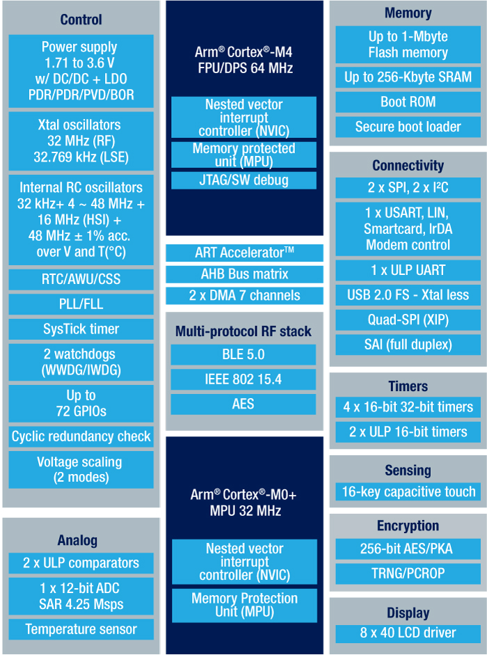
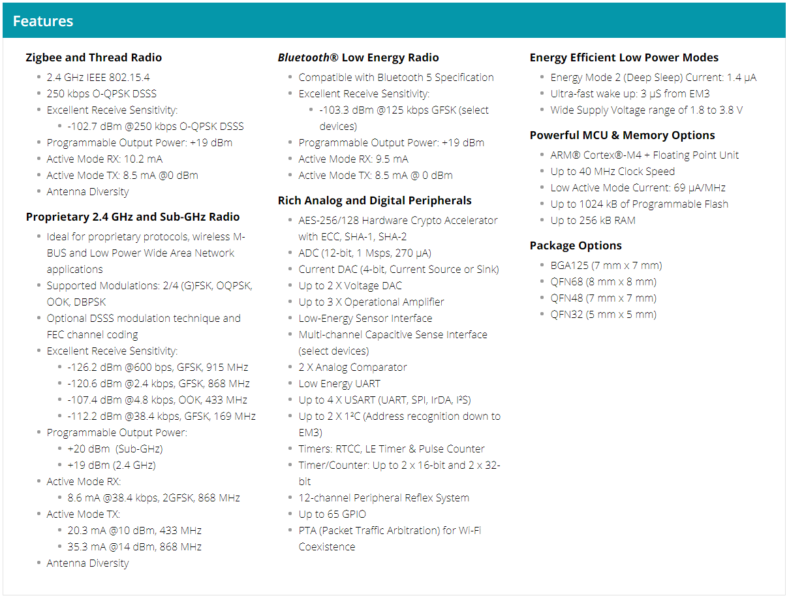
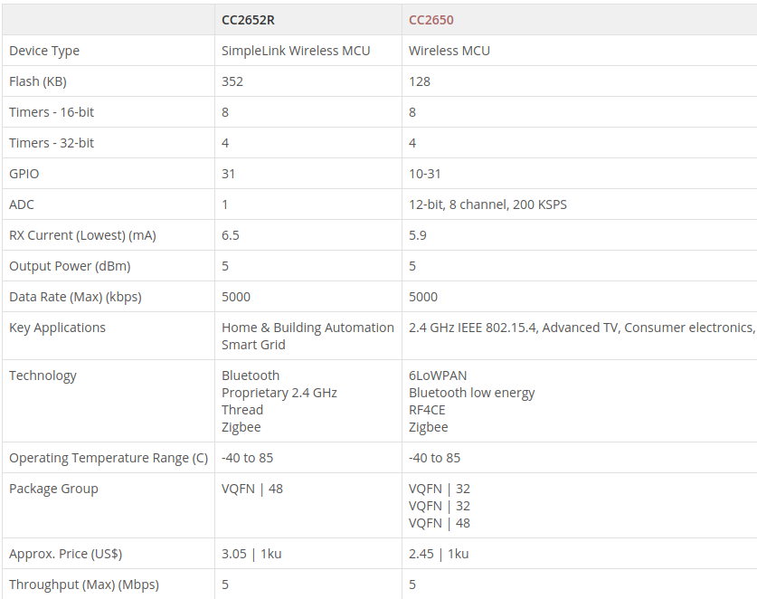
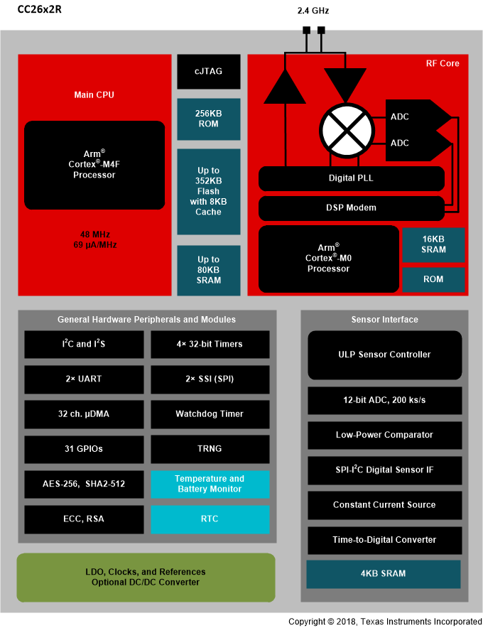

## 1. STM32WB Series
 **A dual-core, multi-protocol and ultra‐low‐power 2.4 GHz MCU Series** -
 https://goo.gl/hfoZHW

The new STM32WB wireless System-on-Chip (SoC) devices combine a fully-featured
Arm Cortex M4-based microcontroller to run the main application as well as an
Arm Cortex-M0+ core to offload the main processor and offer real time operation
on the Bluetooth Low Energy (BLE) 5 and IEEE 802.15.4 radio. The radio can also
run other wireless protocols concurrently, including OpenThread, ZigBee,
or proprietary protocols, giving even more options for connecting devices to
the Internet of Things (IoT).

**Main Features**

 - Dual Processor:
  - fully-featured Arm Cortex-M4-based microcontroller to run the main
application
   - Arm Cortex-M0+ core to offload the main processor and offer real time
operation on the Bluetooth Low Energy (BLE) 5 and IEEE 802.15.4 radio

- Supports OpenThread, **ZigBee** and other proprietary protocols

## 2. EFR32 Mighty Gecko (Silicon Labs)
Mesh Networking Wireless SoCs for Zigbee and Thread - https://goo.gl/3kD6LL

**Main Features**

- Single Processor 
- ARM Cortex-M4 + Floating Point Unit
- Powerful radio functionalities

## 3. # CC2652R (Silicon Labs) Dev Kit - 39,99$ (unit price - 3,05$ / 1 ku)
SimpleLink Multi-Standard CC2652R Wireless MCU - https://goo.gl/V2j1K5

**Main Features**

- ARM Cortex-M4F Processor
- ARM Cortex-M0+ Co-Processor
- BLE 5
- 802.15.4

## 4. nRF52840 (Nordic Semiconductor) - 3.26$ per 2500 Units 
 **High-end multiprotocol Bluetooth 5 SoC** - https://goo.gl/GWtSbn

nRF52840 is an ultra-low power 2.4 GHz wireless system on chip (SoC) integrating a multiprotocol 2.4 GHz transceiver, an ARM® Cortex®-M4F CPU and flash program memory. It is the ultimate SoC for any short range wireless personal area network or IPv6-enabled automation application.

#### Supported Protocols####
- Bluetooth Low Energy 5
- the ANT
- 802.15.4 (Thread, Zigbee)
- user-proprietary 2.4 GHz protocols
- An 802.15.4 protocol library and a certified USB stack are also available.

**Main Features**

- 32-bit ARM Cortex-M4F @ 64MHz
- Bluetooth 5 ready multi-protocol radio
 - 2Mbps
 - Long range
 - Advertising extensions
 - Improved coexistence (CSA #2)

- IEEE 802.15.4 radio support
 - Thread
 - **Zigbee**
