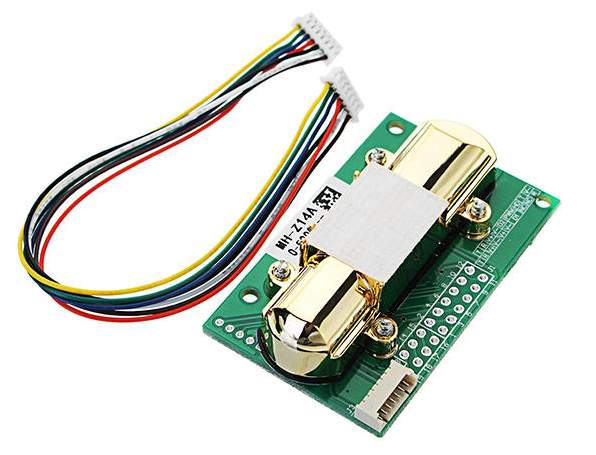

# Netatmo Smart Indoor Air Quality Monitor - EUR 99,99

The documentation includes the procedure involved in the teardown of **Netatmo Smart Indoor Air Quality Monitor** and an analysis of the various components used in the product.

## Teardown Procedure
### 1.
The Netatmo has an smooth finish and looks good overall. Pry open the plastic case (more kind of a snap on lid) to reveal the screws.

Remove the screws to see the inside of the Netatmo.

### 2.
Use some force to lift the assembly out of the casing.

In other products, the WiFi/Bluetooth antenna was etched on the PCB itself, but for Netatmo, it is a metal wire which acts as the antenna. I don't know if it is stupid or genius.

There are two screws on both the ends keeping the two parts of the asembly together. Remove the screws to separate them into two.

### 3.
Separate the PCB from the plastic casing.

I guess the casing for the Netatmo is a generic one which they might be using for multiple products. There are some grooves to accomodate LEDs and other components which, however, is not relevant for this product.

The tube like structure we see on one side of the PCB is the non-dispersive Infrared CO2 sensor and the details of this sensor has been added in the documentation for the Air Quality Sensors also.

_**MH-Z14A(Winsen)**_ - 19,99 €

Datasheet - https://goo.gl/RDca3A

MH-Z14A NDIR Infrared gas module is a common type, small size sensor, using non-dispersive
infrared (NDIR) principle to detect the existence of CO2 in the air, with good selectivity, non-oxygen dependent and long life. Built-in temperature compensation; and it has digital output, analog voltage output, and PWM output.

***Detectable gases: ***
- Carbon Dioxide (CO2)

### 4.
The main MCU on the Netatmo is STM32F401 - Datasheet (https://goo.gl/oS7U3L)

There is also a AP6212 chip which has WiFi,Bluetooth 4.0 and FM RX capabilities (Datasheet - https://goo.gl/r6DsYe)

# Takeaway
The **Netatmo Smart Indoor Air Quality Monitor** has many features but I feel like it is too expensive for its capabilities. The total sensors it makes use of are temperature, humidity, sonometer and CO2 sensors. Out of these, the CO2 sensor is expensive ($20) but the remaining sensors are inexpensive. They have put forward a good looking product with below average features but they have found a way to present the outputs of the product in an aesthetic way. The App looks attractive and catchy and it also works with Apple HomeKit.

The **downside** of the product is that it has no battery and it works only when plugged in.

Suggestions for Sirius:

- We could use the CO2 sensor which does a decent job of measuring the indoor air quality. We could use it on the premium version of Sirius B.
