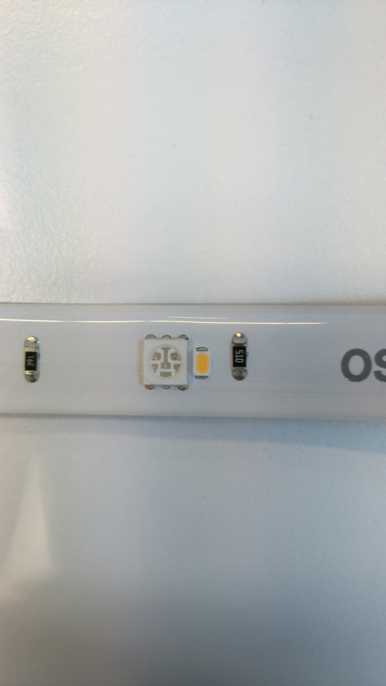

# Osram Lightify Teardown

The file includes the various steps involved in the teardown of **Osram Lightify** LED Light strip and the information about the  different components used in it.

## Teardown Procedure
1. The Osram Lightify is a neat and elegant LED light strip from Osram which works with Zigbee Protocol. The Lightify Strips comes with a kit which includes the power supply and a controller. It is Philips Hue Bridge compatible and was tested to work with the Hue Bridge. The power supply used for the Osram Lightify is 12V 3.0A 36W.

2. The light strip works pretty well with the Hue Bridge but times it shows a slight delay.

3. The different segments of the light strips are connected to one another by the conventional male-female headers.

The header shows the different lines on the light strip namely the RGBW and the positive supply line.

4. The Lightify controller is quite compact and lightweight. The ratings of the controller are 12V DC 36W.

5. The controller was tore opened by lifting the cover applying force. It's a snap lock and it opens quite easily if pried with light force at the snaps.

The top part of the PCB is shown below:

Q1-Q4 are the power transistors driving the four different LED sets (RGBW). They provide the PWM switching to the LED channels I believe.
The different ICs it has are:
  - 1201DN - AF40 (x4) (Power transistors) - Datasheet - https://goo.gl/5kkBnf // Can't find the exact Datasheet. I guess this is a custom IC made for Osram.

  - CJT1117B - Power Management IC - Datasheet - https://goo.gl/3YrwN4

The bottom part of the PCB has a daughter PCB on it.

The IC here is a Marvell [MZ100](http://www.marvell.com/company/news/pressDetail.do?releaseID=5457) Zigbee microcontroller.