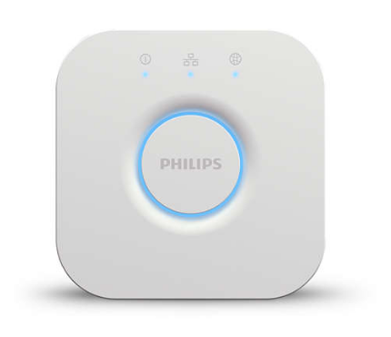

# Philips Hue Bridge Teardown - EUR 59,99

The documentation includes the various steps involved in the teardown of **Philips Hue Bridge** controller and the information about the  different components used in it.

## Teardown Procedure
The teardown is pretty much straightforward. At the bottom of the Bridge, there are four rubber pads concealing screws. There are only two screws. Unscrew them and open the bridge. There's only one PCB inside the bridge but it has a lot of different components on it.

## Components

- QCA4531-BL3A - QUALCOMM WiFi Module - Datasheet - https://goo.gl/YTkmh5
- Winbond W9751G6KB-25 - DDR2 SRAM - Datasheet - https://goo.gl/EyqrxL
- W25N01GVZEIG TR - FLASH - NAND Memory IC
- M-TEK H16129SCG - Network Adapter (ethernet)
- Atmel SAM R21E - SMART ARM-Based Wireless Microcontroller - Datasheet https://goo.gl/q1hkkN
