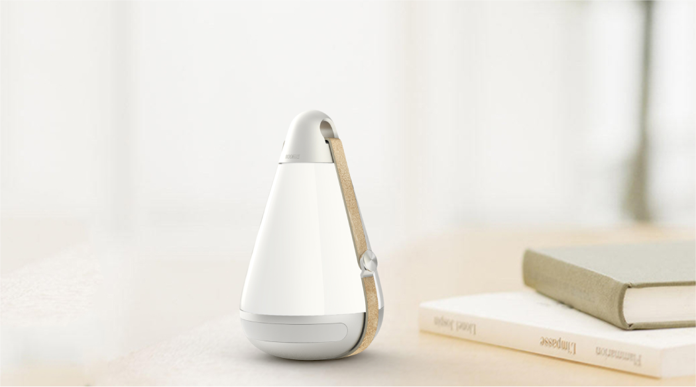
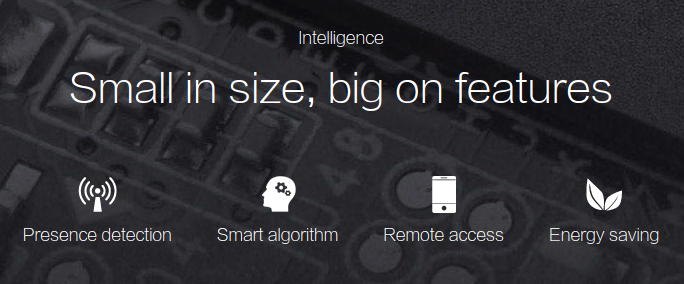
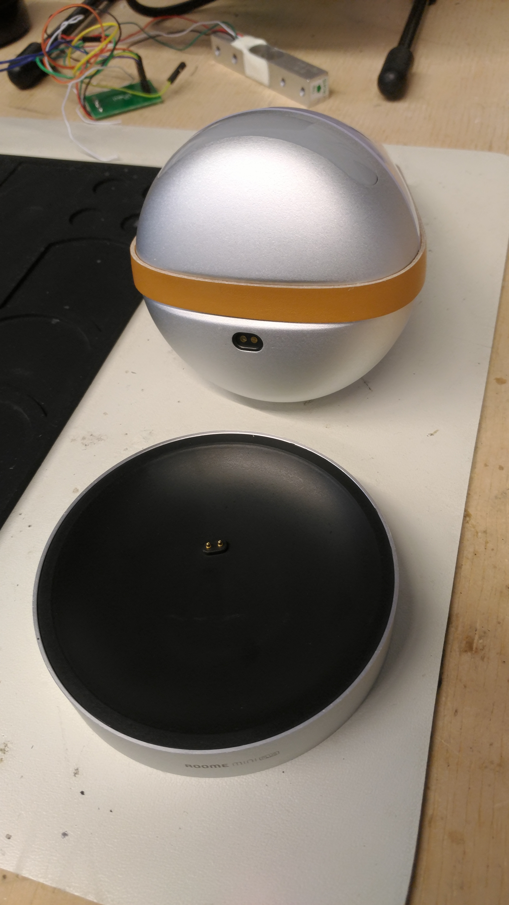
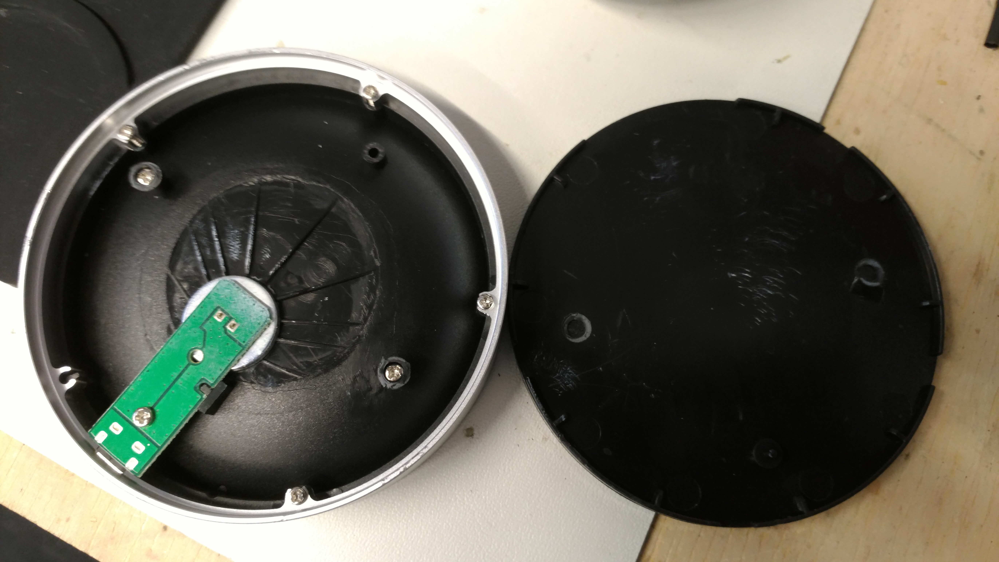
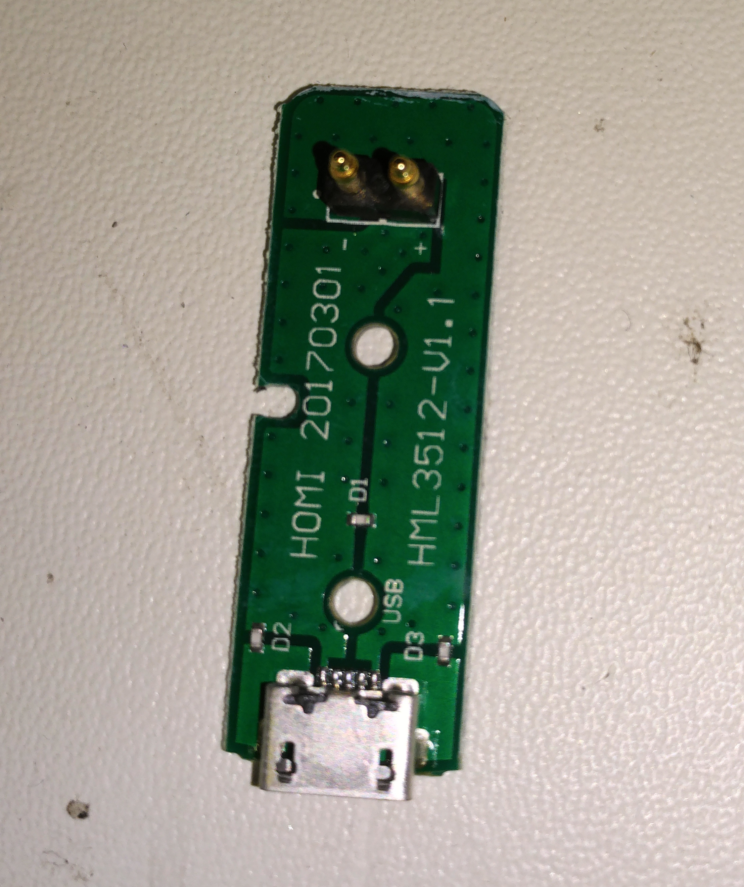
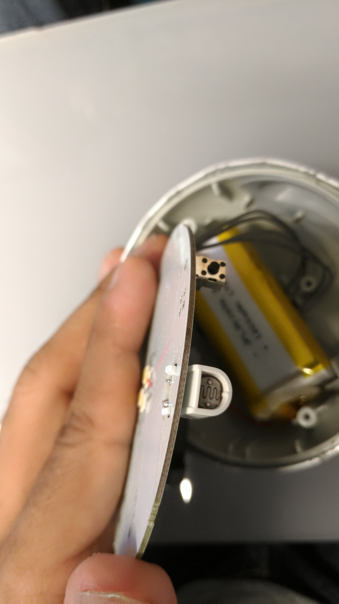
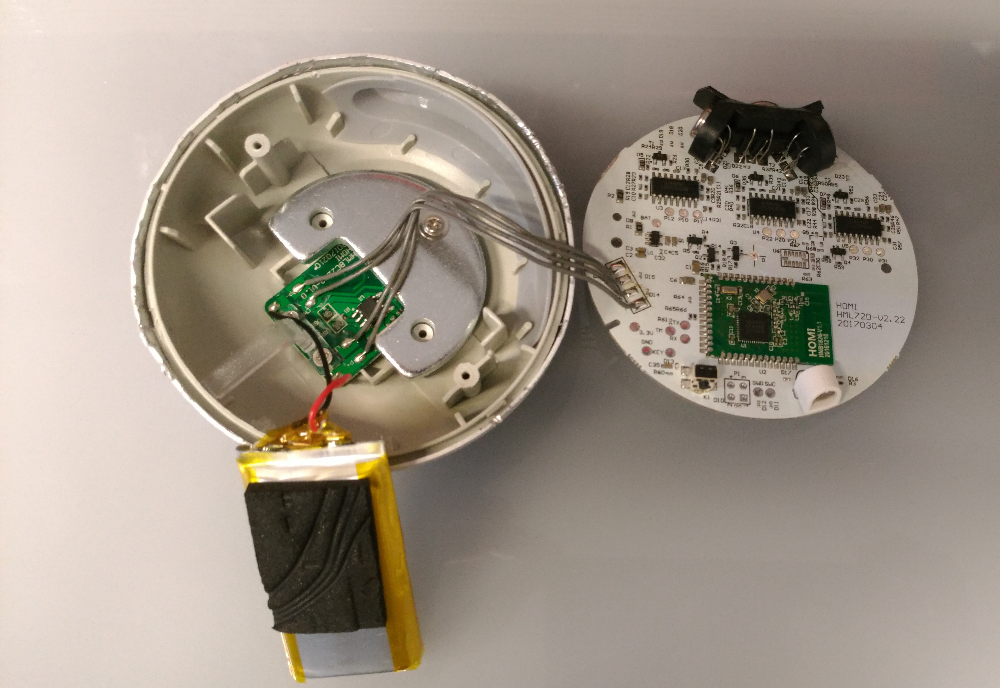
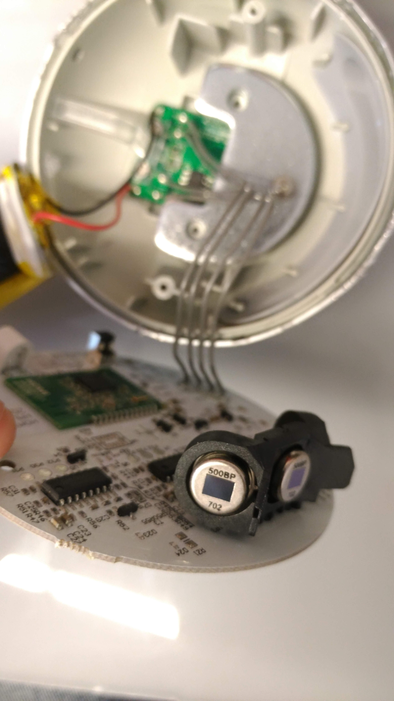

# Roomelight Mini Plus - $ 29,99

The documentation includes the procedure involved in the teardown of **Roomelight Mini Plus** and an analysis of the various components used in the product.

The Roomelight Mini Plus on first-look seems to be appealing. It has got a aluminium alloy top and base and a plastic light disperser in between. It's quite difficut to open the product without damaging the body. The Roomelight Miniplus comes with a charging base which also has a neat finish.

**Primary Features:**
- LED 0.8W
- Battery -  1200 mAh rechargeable lithium battery
- Charging time - 2 hours
- Battery - 15 hours continuous lighting

## Teardown Procedure
1.

The bottom of the charging base has a rubber layer which can be peeled off to reveal the screws and the screws can be removed to expose the inside of the charging base which is, not so surprisingly, very simple.

It has a small PCB which takes the power from the USB mini port to the contacts which comes in contact with the base of the Roomelight Miniplus.

2.
Once the Roomelight Miniplus is opened, the top part of the PCB is exposed on which the LED lights are visible. Although the top part of the PCB seems to be surprisingly simple, the bottom part is quite complicated.

After removing the screws mounting the PCB on the base, flip the PCB to view the bottom part.

The base shows a N51822 chip (which might be a variant of nRF51822 - Nordic Semiconductor) which is a powerful, highly flexible multiprotocol SoC ideally suited for *Bluetooth® Low Energy* and 2.4GHz ultra low-power wireless applications. It has also got three BISS0001 ICs which are PIR (passive infra-red) motion sensors.

There is also one LDR sensor to detect the light in the room.

3.
Under the main PCB there's a small metal weight, a battery and also another PCB which handles the charging function. The metal weight is attached to the bottom frame with a screw and remove it to properly see the bottom PCB.

Also on the side of the main PCB you can see three PIR500BP Analog signal pyroelectric infrared sensor. I believe these are connected to the  BISS0001 ICs via the PCB. And hence we have three numbers of both PIR500BP and BISS0001.

4.
The battery used in the Roomelight Miniplus is a **3.7V** ***1200 mAh*** battery.

5.

The following images are the top and bottom of the mini PCB present at the bottom of the Roomelight Miniplus.

# Takeaway
The **Roomelight Miniplus** was a decent product. Although we had trouble setting up another product from Roome (Roomelight Air Touch), the setting up of the Miniplus was not that difficult. It was paired with the device via Bluetooth. The light could be controlled using the app in different ways. It was possible to switch the light ON/OFF, set a timer for the light, and also adjust the brightness of the light.

Suggestions for Sirius:

- They claim to have a wireless charging feature which is true to an extent. We have to place the light on the charging base and if the contacts are perfectly aligned, then it gets charged. If there were some matching grooves on both the charging base and the product, then it would have been super cool. In their video, they advertise as if we can just place the light on the charging base and it gets charged but its far from being true. If we can play around with some designs which could help us build a better wireless charging base, then it will be a really cool feature and as a user, I would love to have wireless charging for my Sonnenglas. :)
- It has three PIR motion sensors which cover a wide area and turns on/off automatically detecting the presence/absence of people. It is also a good to have feature.
