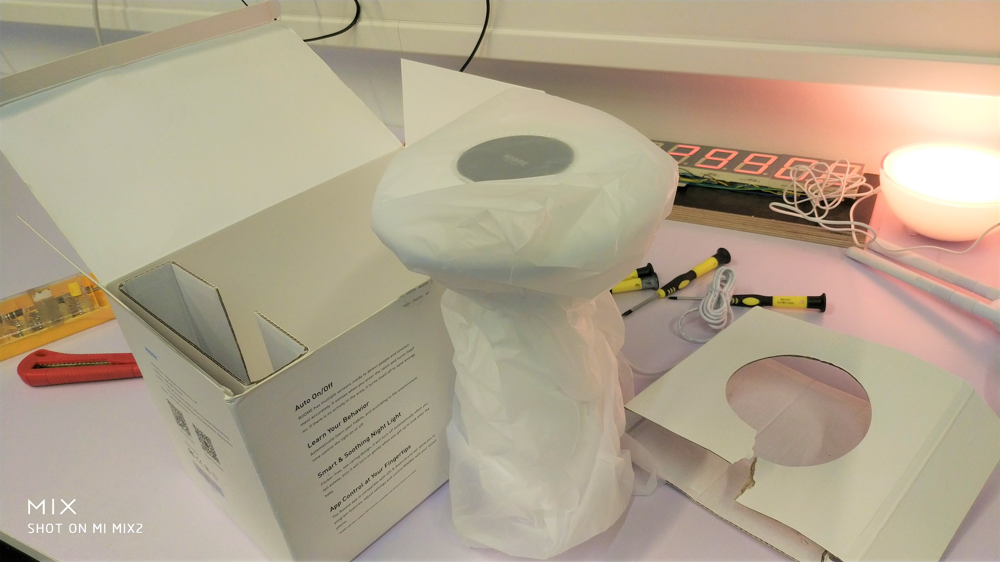
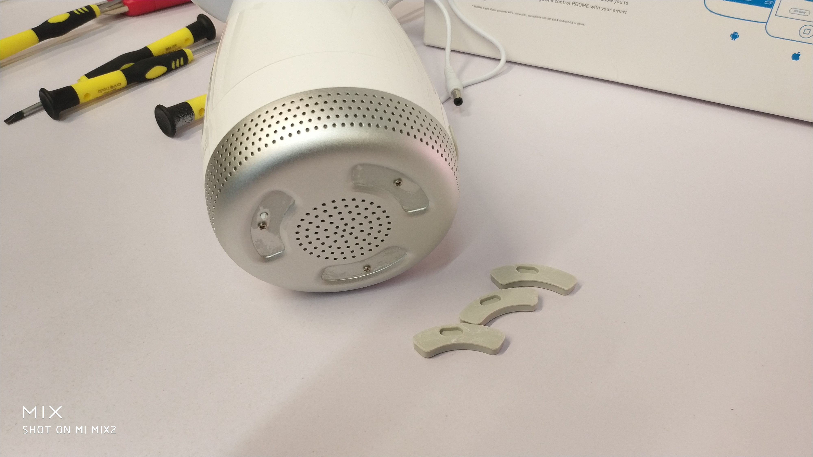
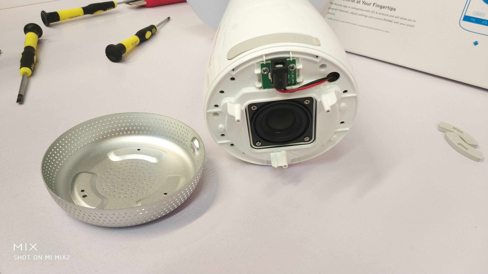
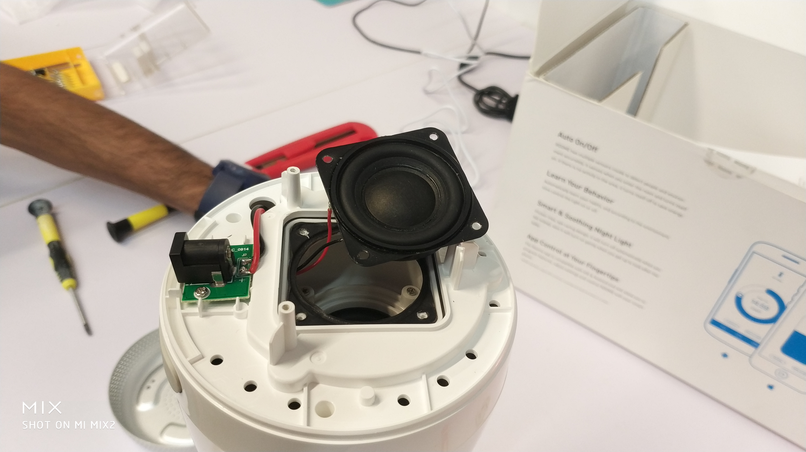
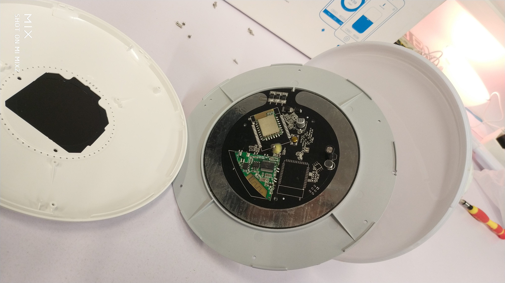
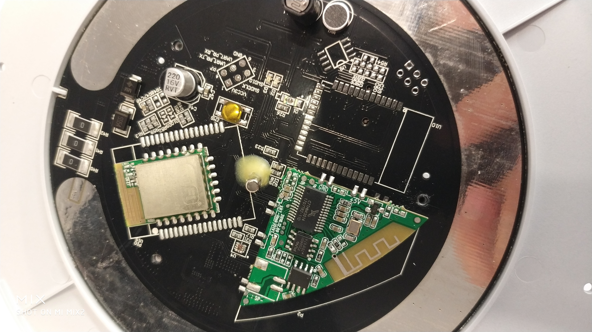
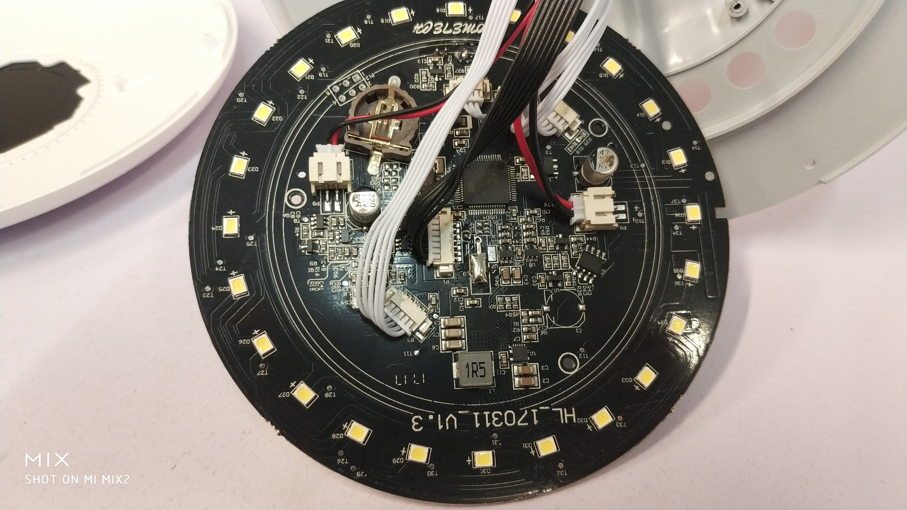
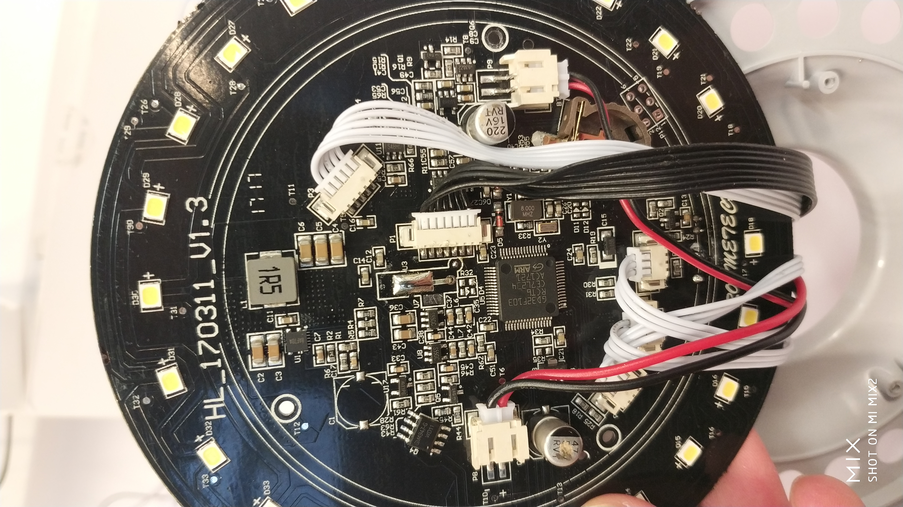
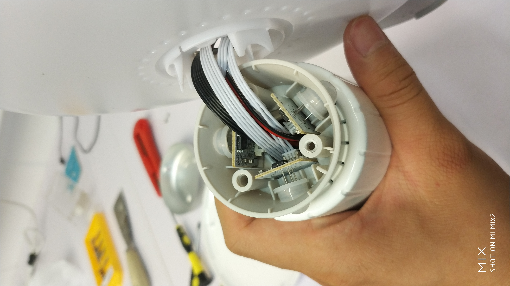

# Roome Light Air Touch Teardown
The documentation includes the various steps involved in the teardown of Roome Light Air Touch controller and the information about the  different components used in it.

The Roome Air Touch comes in a thin, cheap-quality box, which serves its purpose though. To free the light from the packaging, a piece of cardboard needs to be rip off.

## Teardown Procedure
To get access to the inside, the Roome Air Touch was opened from the bottom. Three screws which are places unded the rubber feet need to be removed, then the aluminum base plate, which also servers as a grill for the integrated speaker comes off.

The speaker is a 1.5 inch chassis in a very small enclosure with an integrated passive radiator. The sound quality is not impressing. Next to the speaker, there is a small board which just carries the DC Power Jack.

The more interesting components are placed in the head of the light. The top can be simply removed by removing the screws and bending a few plastic clips. The overall build quality feels very cheap, so there were concerns to break the light during this process. After disassembling the cover, a round PCB shows up.

 

On the top side, the Wi-Fi module and the Bluetooth module are placed on their solder footprints. The round metal stripe is the sensor for gesture control. The small tube in the middle is a vibration sensor.

 

On the bottom side, the MCU and the LEDs are the main components.

In the body of the light, there are 3 PIR motion sensors for presence detenction. Those components, along with the speaker, are connected to the main PCB with connector cables.

## Part List
- MCU: GD32F103 (a STM32F103 clone)
- Bluetooth: CT7THN43014 Module (Bluetooth Audio only)
- Wi-Fi: UA402

## General impression
In contrary to its advertisement, the product felt cheap from the first minute. The build material is thin and does not look or feel high quality. This impression gets confirmed when trying out the functions. The quality of the Bluetooth speaker as bad as they could have skipped the feature. The gesture control does not work reliably. The LEDs have a fixed cold white color temperature. They sit behind a opaque cover, which does not distribute the light well. The Wi-Fi refused to connect to our network. After trying a mobile phone Hotspot, the light did connect to the Wi-Fi, it refused to be added to a room, making the controlling via Wi-Fi unusable in the end.

The software can ok, it could not be tested completely because the Wi-Fi connection didn't work. But the QR-code to the download link led to an error 404 address, so the app needed to be found manually in the Appstore.

## Takeaway
The Roome Air Touch is a good example of how NOT to make a light product. It's overloaded with unnecessary features, which all don't work properly. Almost all details of this product don't make an impression of a well-designed product. The struggle of Wi-Fi pairing is a no-go and should be avoided. Gesture control is also a dangerous field, as the consumer need to be tought to use the lamp in the first place. It should only come as an additional way of control, not the only one.