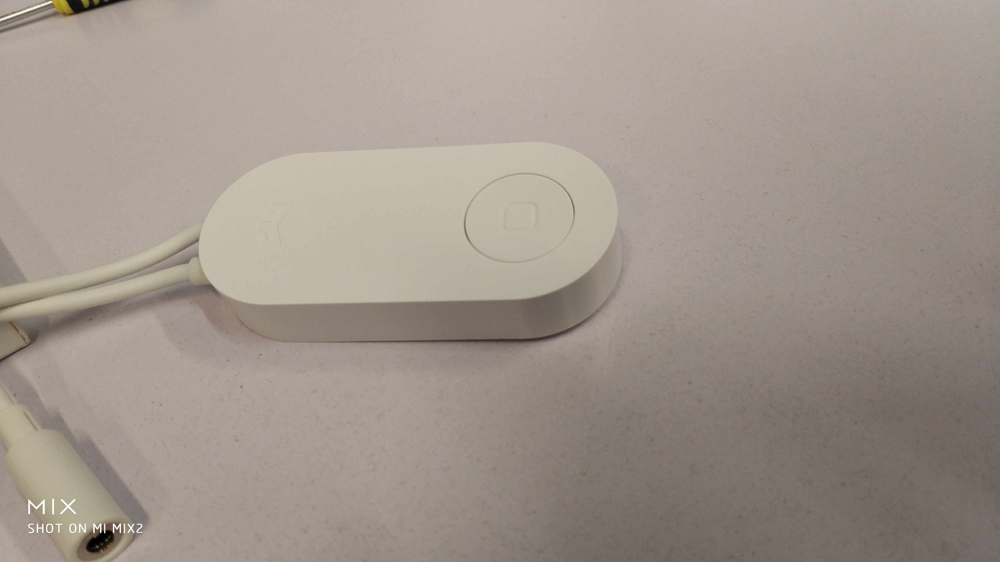
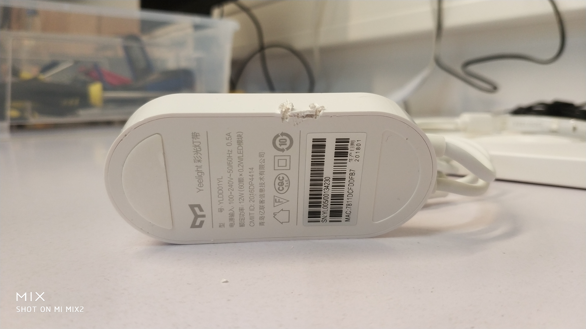
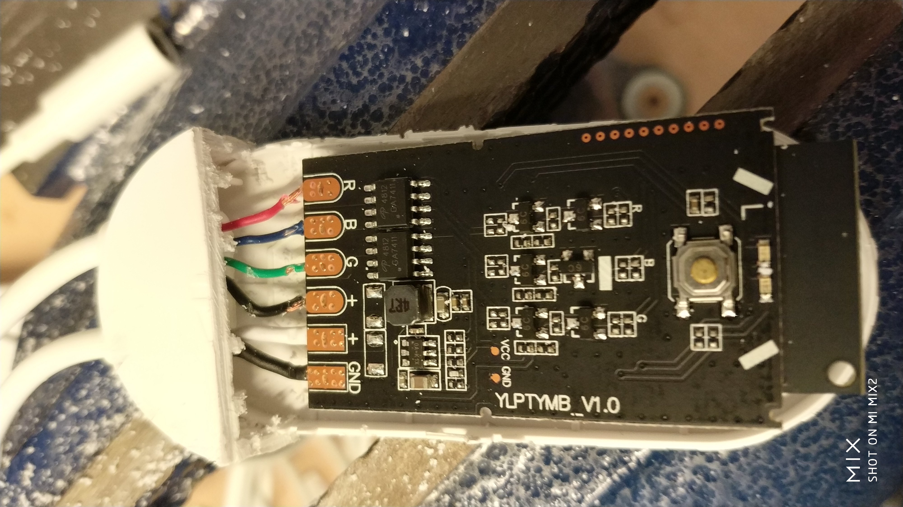
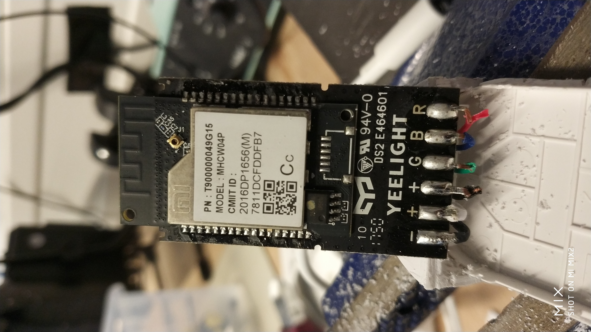

# Yeelight Lightstrip Teardown

The file includes the various steps involved in the teardown of **Yeelight LED Lightstrip** and the information about the  different components used in it.

## Teardown Procedure
1. The Yeelight Lightstrip is a product from Xiaomi which works with WiFi Protocol (IEEE 802.11). The Lightify Strips comes with a kit which includes the power supply and a controller.

2. During testing, it did not work with the Philips Hue Bridge and I believe, it's not Hue Bridge compatible.

3. The controller was sealed and had to damaged to open it. The casing of the controller was sawed and broken down at the different joints to separate the casing.

4. The PCB has 6 different lines viz. - RGB, 2 '+'s and a Ground. The ground and one of the '+'s come from the power supply and the remaining goes to the LED light strip.

The top part of the PCB has two ICs - 4812 GA4711 MOSFETs - (Datasheet - https://goo.gl/sWfNN6)

The bottom part of the PCB has a WiFi Module (the model number returns no information on Google).

