# Yeelight Candela Teardown - EUR 49,99

The documentation includes the procedure involved in the teardown of **Yeelight Candela** and an analysis of the various components used in the product.

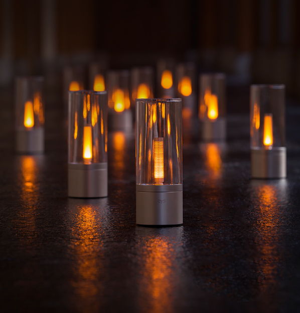

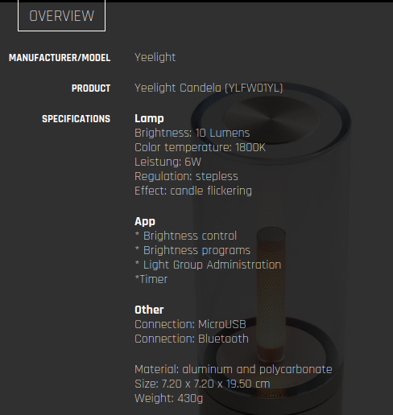

## Teardown Procedure
1.
The Yeelight Candela has an elegent and simple look and it has mainly two parts. The rotatable top part (glass) and the fixed base (Metal/Aluminium).

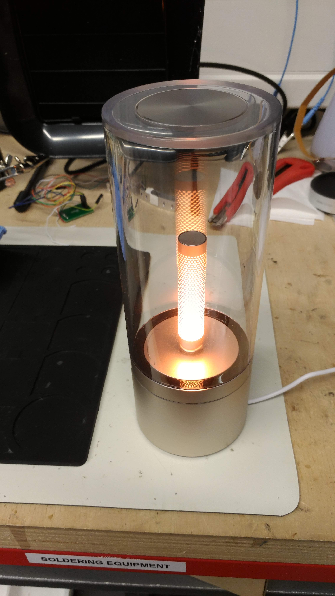

At the bottom of the Candela, there's a rubber layer which shows a charging LED, the ON/OFF switch and also a reset pin. This layer can be pulled off to reveal the screws. Remove all the screws to open the base.

2.
After you open the candela, the top PCB (near the foot of the candle LED) and the bottom PCB (attached to the base) are connected through a power cable and a delicate ribbon cable. So take care when you open the base and make sure the ribbon cable is not damaged.

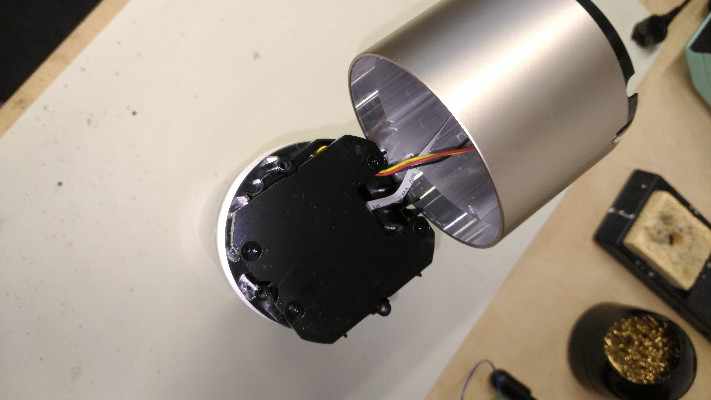

If you want to remove the ribbon cable, it's attached to the bottom PCB through a snap-on lock which can be lifted to detach the cable. Likewise the power cable can be removed by pulling it off.

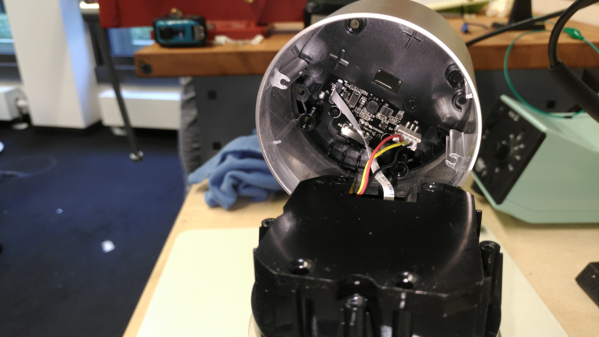

Once all the connections are removed, the PCB on the base can be taken off. It includes the circuitry to handle the charging via USB power and it also houses a 3-position switch which selects between ON/OFF/Bluetooth.

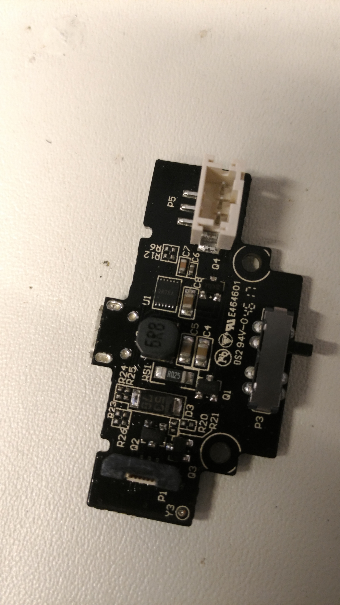

3.
After separating the base, we are left with the top part of the product.

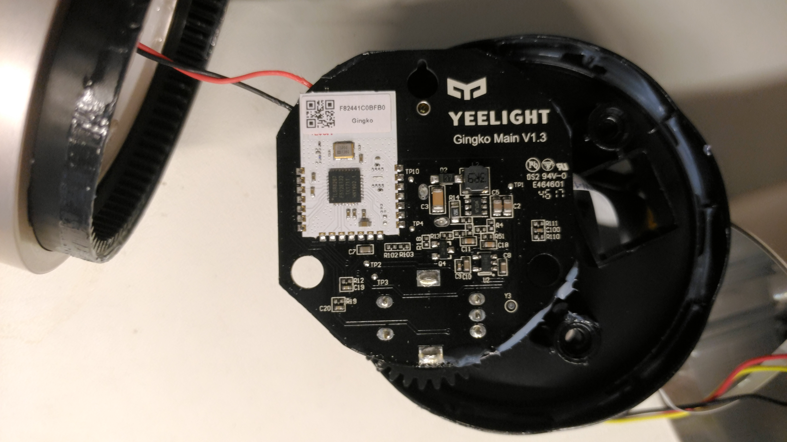
This is the main PCB of the Yeelight Candela. It has an MCU TLSR8267 (Datasheet - https://goo.gl/NZw4rw) which is an Embedded 32bit / 48MHz Microcontroller which supports Bluetooth V4.2 (Low Energy) standard. The entire logic of the Microcontroller is handled by this PCB. The other side of the PCB is also attached to a gear system which controls the brightness of the candela.

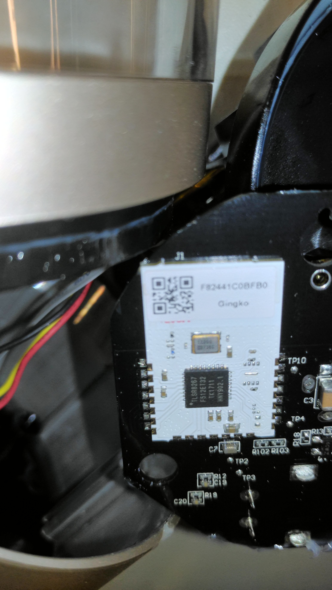

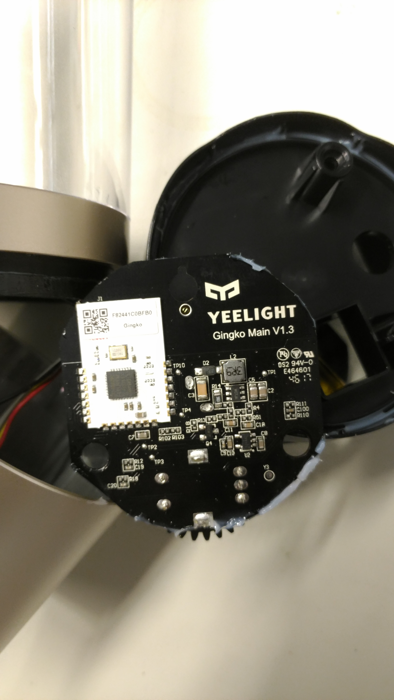

4.

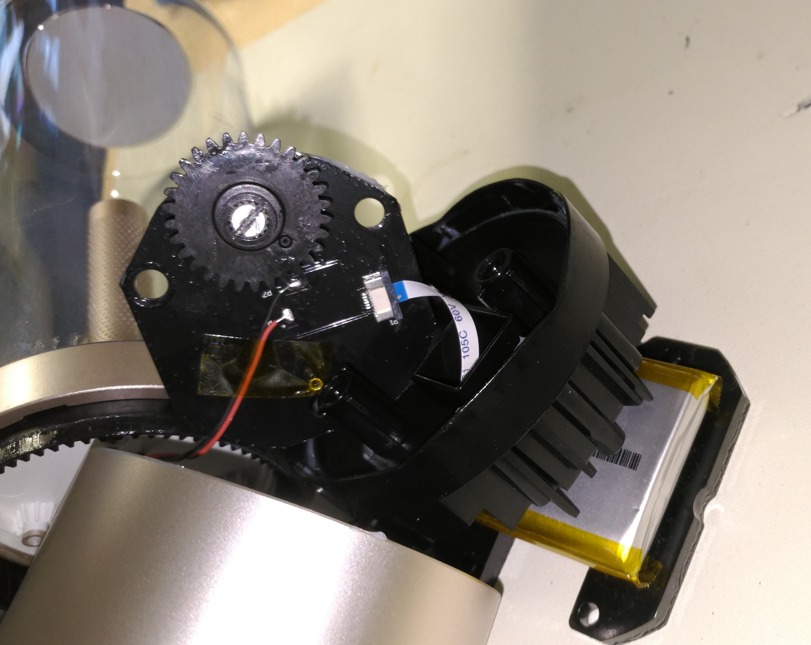

The image shows the both the the gears - one attached to the glass body and the other attached to the other side of the PCB.

5.

This is the battery which is used in the Yeelight Candela. As printed on its body, it is a **3.7V** **2100 mAh** ***7.77Wh*** battery.
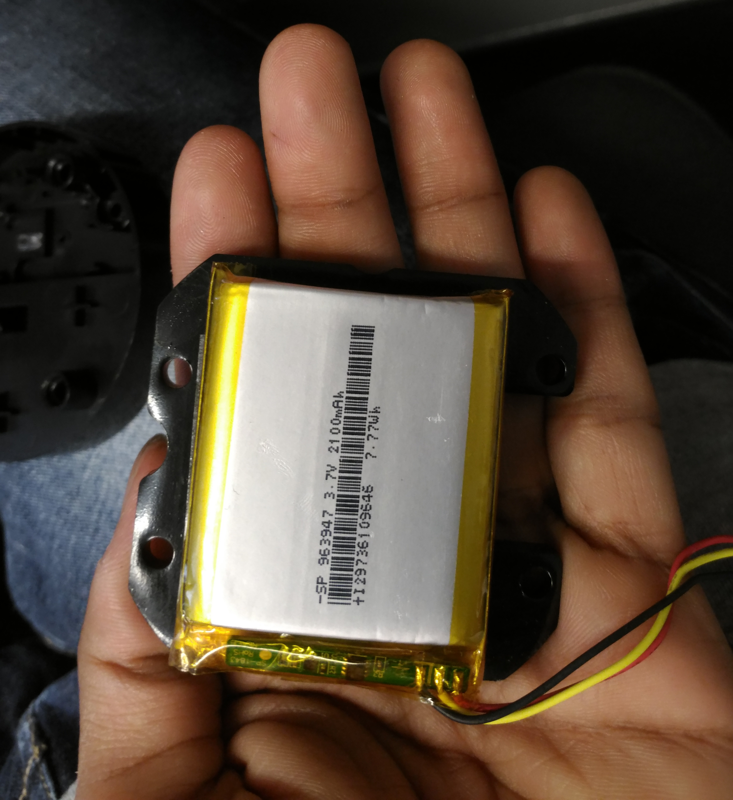

# Takeaway
The **Yeelight Candela** is an awesome product for its price. Unlike some other products we tested, the Bluetooth pairing was hassle free with the device handshake being completed by turning the glass frame. That was an interesting feature on confirming the pairing request. One downside was that at the maximum brightness, the Candela LED hurts the eyes a bit if kept somewhere near. But altogether, the product design is amazing and looks super elegant.

Suggestions for Sirius:

- The pairing feature by rotating some part of the product seems fancy and is a nice feature.
- Instead of having a large rotating top part as in the case of the Yeelight, a rotating golden ring or something similiar might make it look more elegant.
- The brightness adjustment could be done by rotating the golden ring similiar to Yeelight. 
